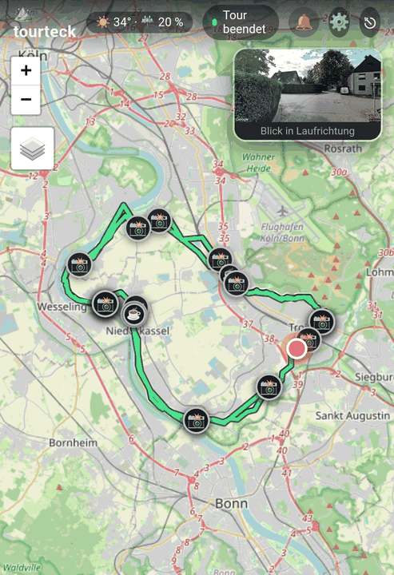
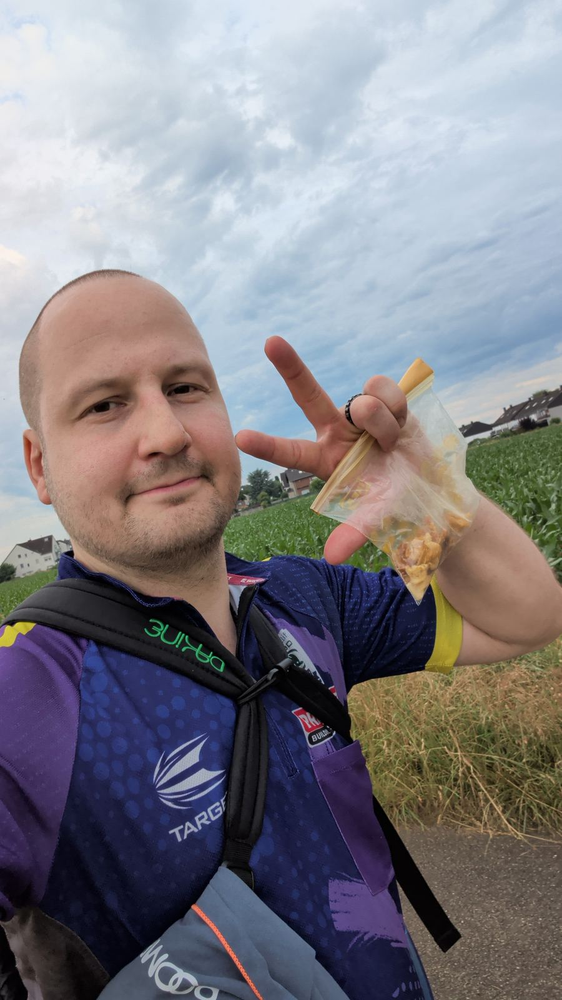
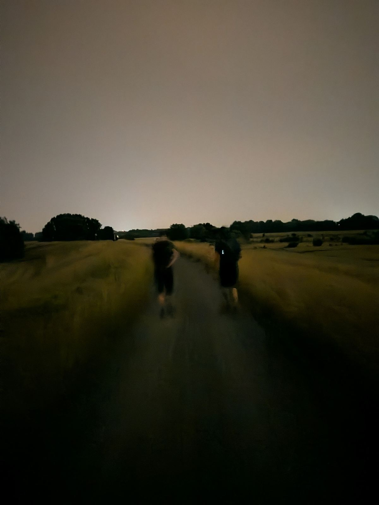
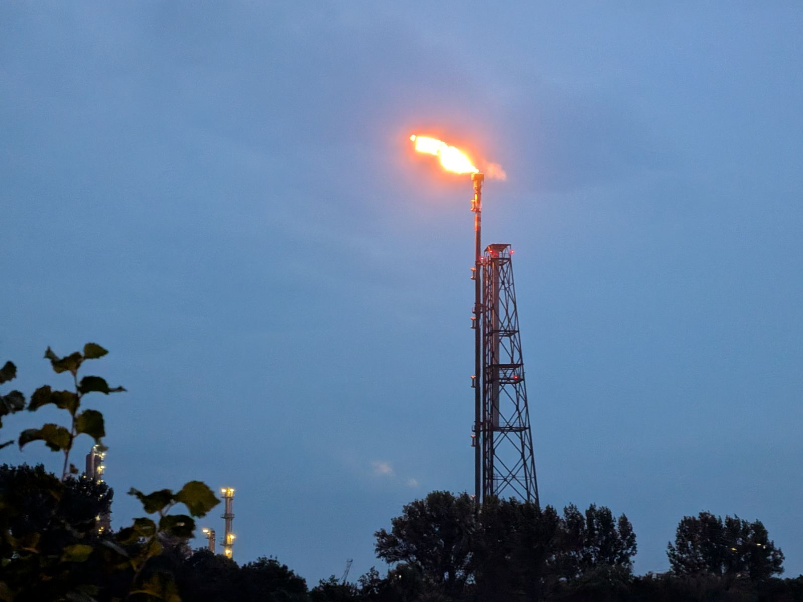

# 42 Kilometer? Ein Spaziergang!

> **Triggerwarnung:** Dieser Text erwähnt Depression und wie sie meinen Alltag verändert hat. Nichts Dramatisches, aber falls das gerade kein gutes Thema für dich ist, spar ihn dir für einen anderen Moment.

Ich bin am letzten Wochenende am Rhein entlang und wieder zurück nach Hause spaziert. 42 Kilometer.

Das klingt nach einer Sache, die man trainiert.

Ich hatte nicht trainiert.

## Wie das überhaupt passiert ist

Im Herbst 2024 habe ich [über meine Depression geschrieben](#depression). Was ich da nicht ausführlich beschrieben habe: Spazieren war eines der ersten Dinge, die mir in dieser Zeit wirklich geholfen haben. Nicht als Sport. Als Werkzeug. Kopf raus aus den Grübel-Schleifen, Gedanken geordnet kriegen, einfach mal aufhören, stillzusitzen und innerlich zu rotieren.

Ich bin viel gelaufen damals. Kurze Strecken, langsame Strecken, Strecken ohne Ziel.

Ein guter Freund von mir wandert regelmäßig und neigt dazu, bei Touren manchmal ein bisschen zu übertreiben.

Ich habe ihn irgendwann unverbindlich gefragt, ob wir das nicht auch mal zusammen machen wollen. Wandern. Ein bisschen. Für Einsteiger.

Aber es kam sofort ein Termin. Und für den hatte er 42 Kilometer vorgesehen.

## Letztes Jahr: 36 Kilometer und dann Schluss

Niemand hat wirklich erwartet, dass ich lange dabei bleibe. Mein Freund vielleicht ausgenommen. Ich selbst auch nicht komplett. Aber ich wollte es mir selbst beweisen, dass ich das kann.

Nach 36 Kilometern war es vorbei.

Mein Freund hatte mir vorher trotzdem schon eine kleine Medaille gebastelt, auf der "42 km" stand. Die habe ich dann nach dem Abbruch in den Händen gehalten und gewusst: das kann ich nicht so stehen lassen.

Also musste ein zweiter Versuch her.

## Dieses Mal: ein paar Dinge besser machen

Ein Jahr ist viel Zeit, um darüber nachzudenken, was beim ersten Versuch nicht funktioniert hat. Proviant, Schuhwerk, Klamotten, was man zu Hause lässt. Wir haben alles ein bisschen durchgeplant.

Was ich nicht erwartet hatte: wie viel mir Meditation dabei helfen würde.

Das ist auch etwas, das ich der Depression verdanke. Ich habe lernen müssen, meine Gedanken zur Ruhe zu bringen, weil mein Kopf sonst nicht aufgehört hätte zu rasen. Meditation hatte anfangs gar nicht funktioniert und irgendwie komisch gefühlt. Seit es klappt, ist es ein Werkzeug.

Und beim Wandern habe ich gemerkt, dass die Schmerzen in den Beinen irgendwann nicht nur ein körperliches Problem sind, sondern eher ein mentales. Und ich das bewältigen kann. Durch Trott, Rhythmus, Atmen, leeren Kopf.

## Was ich mitnehme

Die Medaille gehört jetzt mir, und zwar verdient.

Aber das ist eigentlich nicht die Sache, die ich mitnehme.

Die Sache ist: Ich wäre nie auf diese Idee gekommen, wenn die Depression mich nicht erst dazu gebracht hätte, überhaupt wieder regelmäßig draußen zu sein. Die langen Spaziergänge damals haben irgendwann aufgehört, Notfall-Bewältigungsstrategie zu sein, und haben angefangen, einfach etwas zu sein, das mir gut tut.

Und die Meditation, die ich widerwillig gelernt habe, hat mir auf 42 Kilometern mehr geholfen als jedes Training, das ich nicht gemacht habe.

Manchmal bin ich dankbar für das, was mir die Depression auch zeigen konnte.

Der Muskelkater ist übrigens noch da. Aber er wird weniger.
