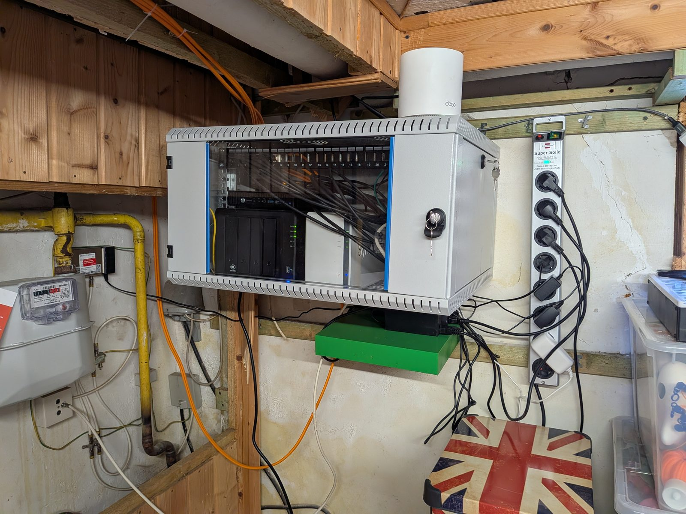

# Das Fundament, das keiner sieht

Der Serverschrank ist keine Übergangslösung mehr.

Seit letzter Woche steht im Keller ein richtiger Schrank: Abschließbar, belüftet, fest an der Wand.

Kein Ikea-Regal mehr. Kein Kabelsalat auf dem Boden, der nach gescheitertem Bastelprojekt aussieht.

Drin läuft jetzt alles zentral: Router, Switch, Patchfeld, Server und mein NAS. Plus das NAS eines Kumpels. Er hostet sein Backup bei mir, ich meins bei ihm. 3-2-1-Backup-Strategie im Reallife: Wenn bei einem von uns die Hütte brennt, sind die Daten beim anderen sicher.

Dazu gab es gleich noch Cat7-Kabel durch den alten Kaminschacht. Gefühlt eine kleine archäologische Grabung im eigenen Haus, aber die Access Points hängen jetzt fest am Netz statt nur als Repeater zu funken.

Was mich an der Aktion am meisten freut, ist gar nicht das schnellere Netzwerk.

Es ist das Gefühl von Kontrolle und Resilienz. Ein Schrank, den man aufschließt, statt Geräte hinter Möbeln zu suchen. Dokumentierte Kabel statt Raten. Und die Gewissheit, dass das Fundament steht. Auch für den Ernstfall.

Das kommt mir aus dem Arbeitsalltag verdammt bekannt vor:

Entscheider interessieren sich meistens für das, was man sofort sieht: das neue Feature, das glänzende Dashboard, die schnelle Oberfläche.

Die saubere Architektur dahinter (Ausfallsicherheit, Wartbarkeit, Backup-Strategien) interessiert oft erst dann, wenn es knallt. Dabei ist genau dieses unsichtbare Fundament das, was ein System überhaupt erst krisenfest macht.

Mein Serverschrank ist der Grund, warum hier alles stabil läuft. Und warum Daten auch im Worst Case sicher sind.
