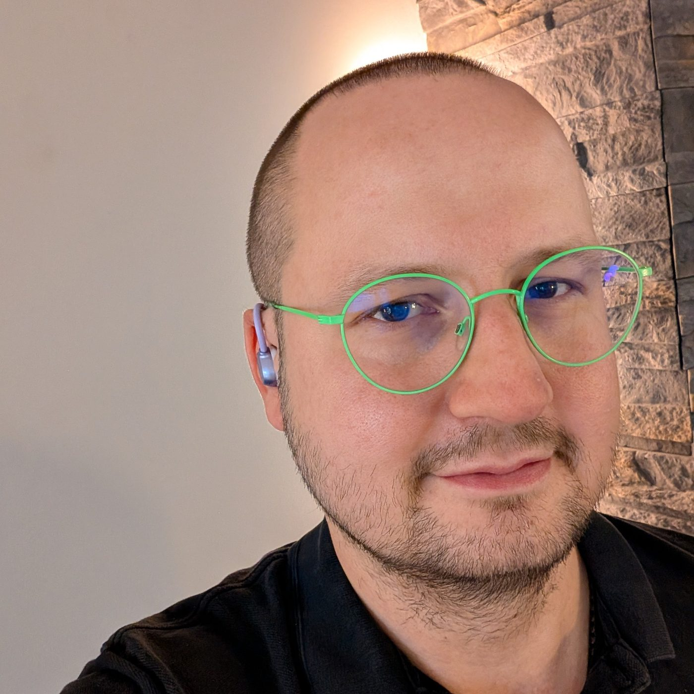
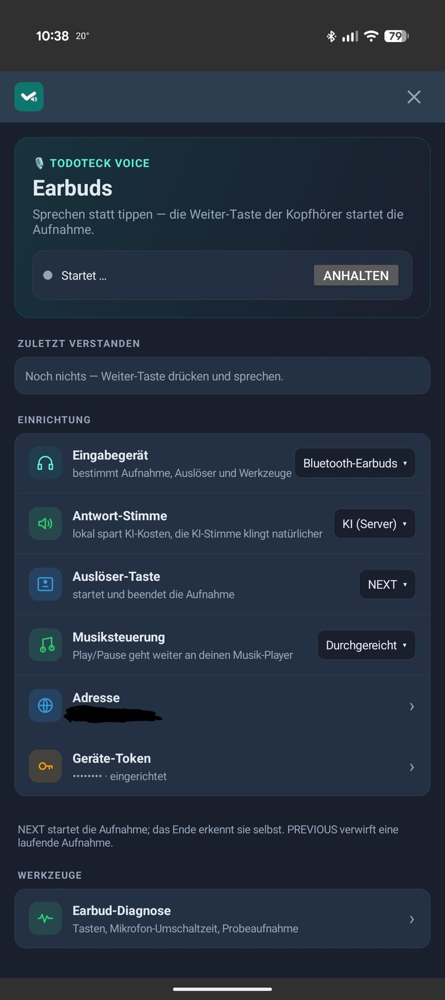

# Die eigene Sprachsteuerung

Vor zwei Tagen habe ich hier über einen kleinen Stick am Armband geschrieben. Taste drücken, reinsprechen, Eintrag steht in unserer Familien-App.

Läuft.

Und dann steht Aylin abends in der Küche. Kopfhörer im Ohr, Podcast läuft, sie räumt nebenbei auf.

Zwischendurch tippt sie kurz an den Kopfhörer und spricht eine Sprachnachricht per WhatsApp ein.

Das Ding kann hören. Das Ding kann sprechen. Und es steckt eh schon in ihrem Ohr.

Warum kriegen wir da nicht unsere App dran?

## Die Kopfhörer müssen gar nichts können

Beim Stick liegt die ganze Logik gar nicht im Stick. Die liegt auf dem Handy. Der Stick nimmt auf und schickt rüber, das Handy redet mit Todoteck.

Es lief also längst ein Dienst, der alles kann.

Der brauchte nur eine zweite Quelle. Statt neuer Hardware also ein paar Zeilen mehr in etwas, das schon da war.

## Wie sich das anfühlt

Langer Druck rechts.

Reinsprechen.

Aufhören zu sprechen.

Zuhören.

Die Antwort kommt als Stimme ins Ohr.

## Nichts davon ist neu

Und genau da liegt der Punkt.

Reinsprechen und eine Antwort ins Ohr kriegen, das kann Gemini seit Jahren. Alexa auch. Siri sowieso. Ich erfinde hier gar nichts. Das Problem ist gelöst, von Leuten mit deutlich mehr Zeit und Geld als ich.

Der Unterschied steckt woanders.

Bei uns läuft der ganze Weg gegen unsere eigene Instanz. Kein Google-Konto. Kein Amazon-Konto. Kein Assistent, der beim Zuhören nebenbei ein Profil baut. Die Aufgabe landet in unserer App, die Einkaufsliste ist unsere Einkaufsliste, und wer sie sehen darf, entscheiden wir.

Und es fühlt sich trotzdem an wie bei den Großen. Gleiche Geste, gleiches Tempo, gleiche Stimme im Ohr.

Das ist der Teil, der mich kickt.

## Erst messen, dann bauen

Ich wusste nicht, wie ein Kopfhörer-Tipp überhaupt am Handy ankommt. Also erst eine kleine Diagnose gebaut und nachgeguckt.

Ergebnis: Die Gesten kommen als Medientasten an. Play, Pause, vor, zurück. Genau die, mit denen man Musik steuert.

Heißt: Todoteck und Spotify wollen dieselben vier Tasten. Wer da wann zum Zug kommt, war der eigentliche Aufwand.

## Warum ich davon nicht wegkomme

Angefangen hat das mit einer Sprachnachricht an einen Telegram-Bot.

Dann war es ein Knopf am Handgelenk.

Jetzt sind es die Kopfhörer, die sowieso schon im Ohr stecken.

Jeder Schritt hat mir gezeigt, wo der nächste liegt. Und jedes Mal, wenn ich denke „so, jetzt reicht's", benutze ich das Ding zwei Tage im Alltag und finde die nächste Kante. Meistens eine, an die ich vorher gar nicht gedacht hätte.

Was mich dabei am meisten umhaut: Vor ein paar Jahren wäre so ein Ding ein Projekt über Monate gewesen. Abende, Wochenenden, Foren durchwühlen, aufgeben, nochmal anfangen. Für die meisten wäre es bei „wäre schon geil" geblieben.

Es waren ein paar Abende.

Ich bin kein Entwickler. Ich vibecode.

Aber ich merke, wie viel ich dabei über meinen eigenen Job lerne. Anforderungen so formulieren, dass am Ende das rauskommt, was ich gemeint habe. Früh sehen, wo das Risiko liegt. Merken, wann eine Hürde eine Sackgasse ist und wann man nur einmal drumrum muss.

Das ist Projektmanagement. Nur eben abends in der Küche statt im Büro.

Und es funktioniert genau dann, wenn man die KI als Sparringspartner behandelt. Wer „mach mal" sagt, kriegt auch „mach mal" zurück.

Das verschiebt, was überhaupt als Idee durchgeht. Sachen, die früher unter „nice, aber unrealistisch" liefen, sind jetzt einfach das nächste Wochenende.

## Und dann steht da noch der Nest Hub

In der Küche. Seit Jahren. Zeigt die Uhrzeit, stellt Timer, spielt Musik.

Ein Display. Ein Mikrofon. Ein Lautsprecher. Und ein Konto bei Google.

Ein Display, das mir unseren Tag anzeigt, habe ich schon. Ein Mikrofon, das mich versteht, seit dieser Woche auch. Eine Stimme, die antwortet, ebenfalls.

Fehlt eigentlich nur noch das Gehäuse.

Mal gucken, wie lange der da noch steht.

## Weiterlesen

- [Der Knopf am Handgelenk](https://niklasfauteck.de/blog/#sprachgeraet-am-handgelenk) — das Sprachgerät, aus dem das hier hervorgegangen ist
- [Einfach reinquatschen](https://niklasfauteck.de/blog/#einfach-reinquatschen) — der Telegram-Bot, mit dem alles anfing
- [Todoteck: Vibecoding für die Familie](https://niklasfauteck.de/blog/#todoteck) — wie die App überhaupt entstanden ist
