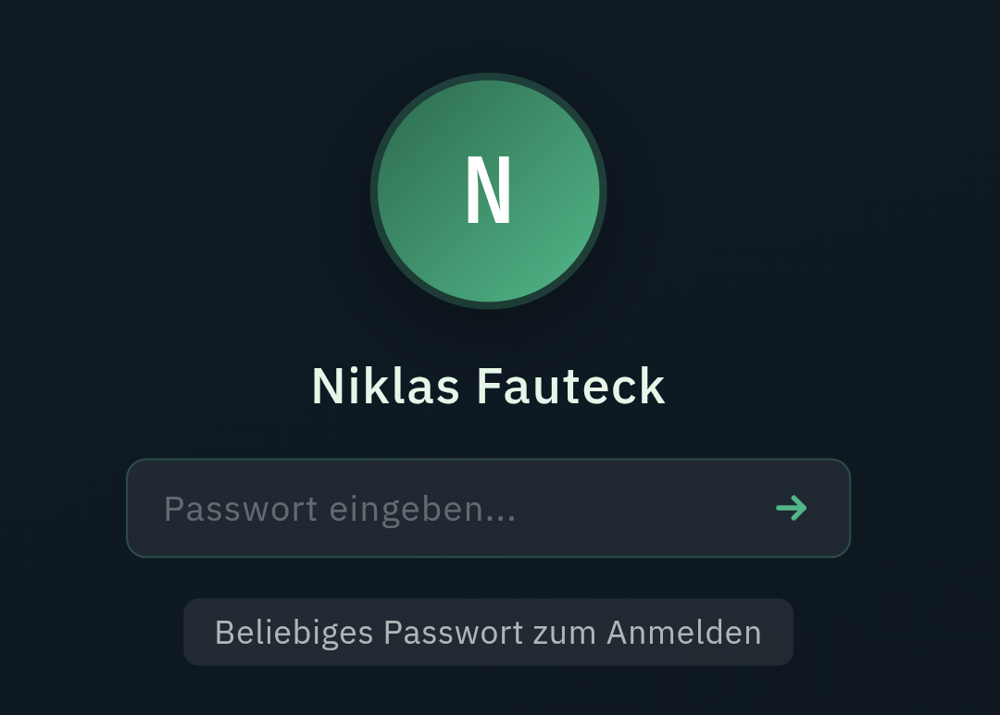

# Ein eigener Ort im Netz

Ich habe mir eine eigene Website gebaut. Und daraus wurde mehr als geplant.

Nach 16 Jahren endet Ende Juli meine Zeit bei RTL. Bevor es weitergeht: erstmal eine Auszeit. Und Zeit für meine Familie. Danach neugierig auf das, was kommt. Und offen für Angebote.

Dafür wollte ich einen eigenen Ort im Netz. Einen, der mir gehört und nicht an einer Plattform hängt. Eine digitale Visitenkarte eben.

Geworden ist daraus etwas mit mehreren Räumen. Eine Startseite, die alles zusammenhält. Eine nüchterne CV-Ansicht. Ein Blog für solche Gedanken.

Und weil ich es nicht lassen konnte, gibt es noch eine verspielte Betriebssystem-Variante zum Durchklicken. Aber das ist eine eigene Geschichte.

Im Maschinenraum steckt erstaunlich wenig. HTML, CSS und Vanilla-JavaScript. Alles statisch im Browser, selbst gehostet auf GitHub. Also auch hier wieder: gevibecodet.

Vibecoding hat mich richtig gepackt. Anderen zeigen, was damit heute geht, auch ohne klassische Programmiererfahrung. Auf der Seite feile ich gerade daran, genau das anzubieten. Ohne zu wissen, wo es genau hinführt. Schreibt gerne, wenn ihr darauf Lust hättet.

Vor zwei Jahren hätte ich das alles nicht gekonnt. Heute schon. Und genau mit dieser Haltung gehe ich in das, was als Nächstes kommt.
