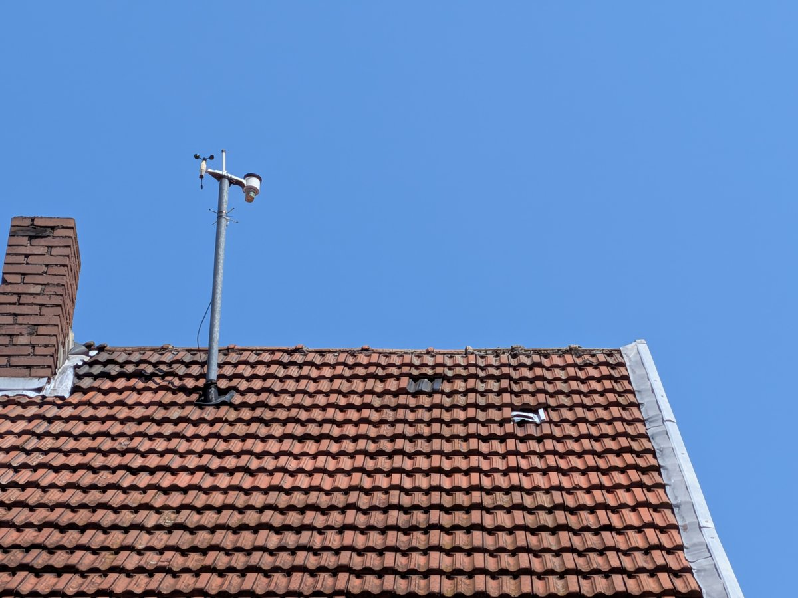
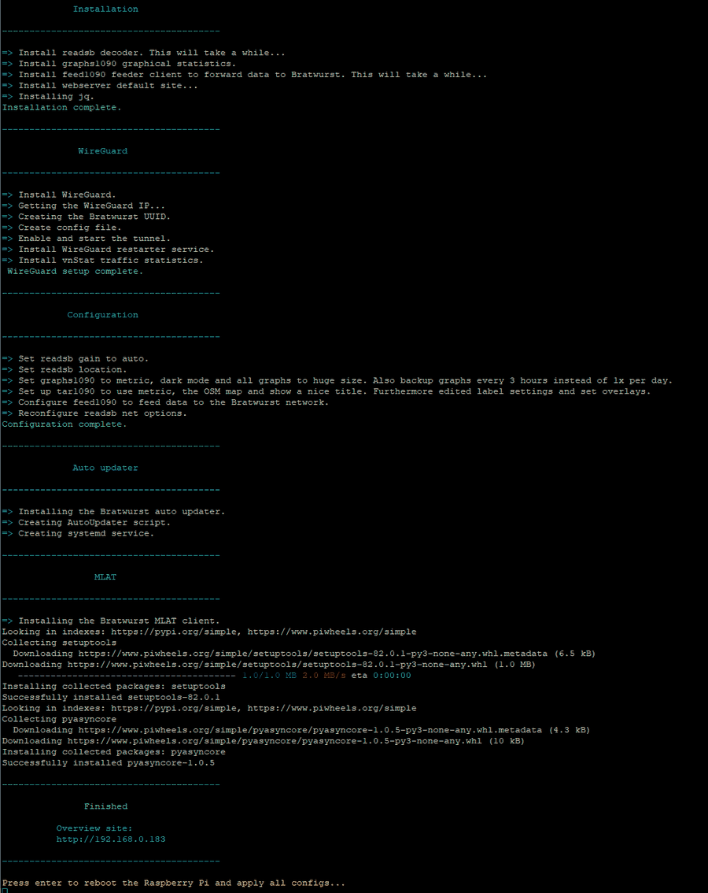
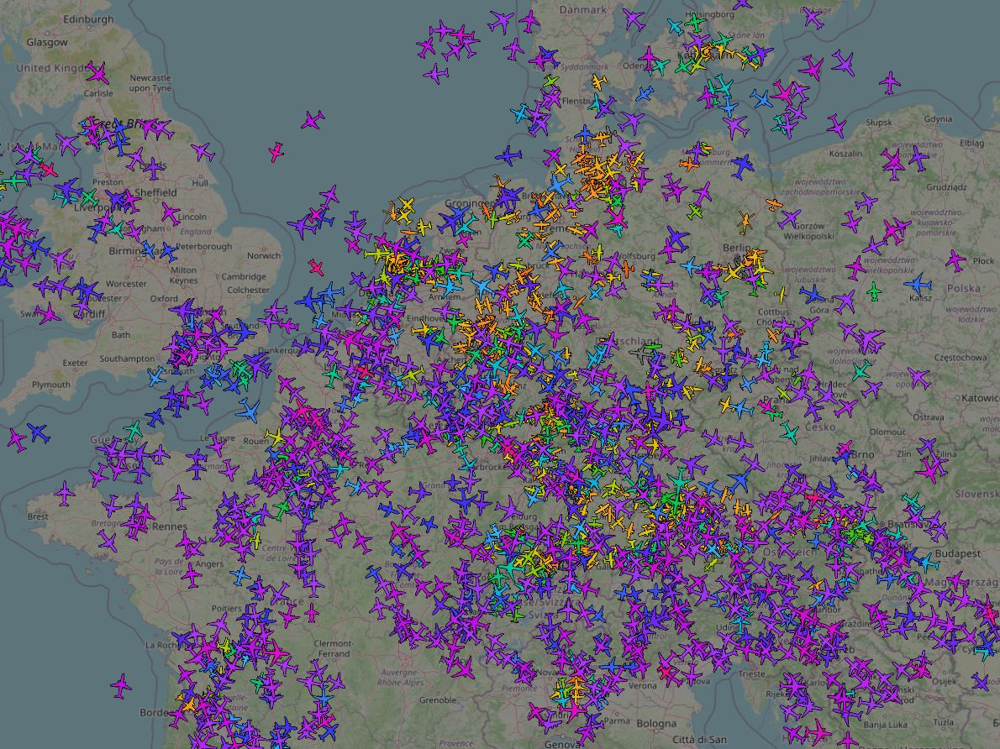
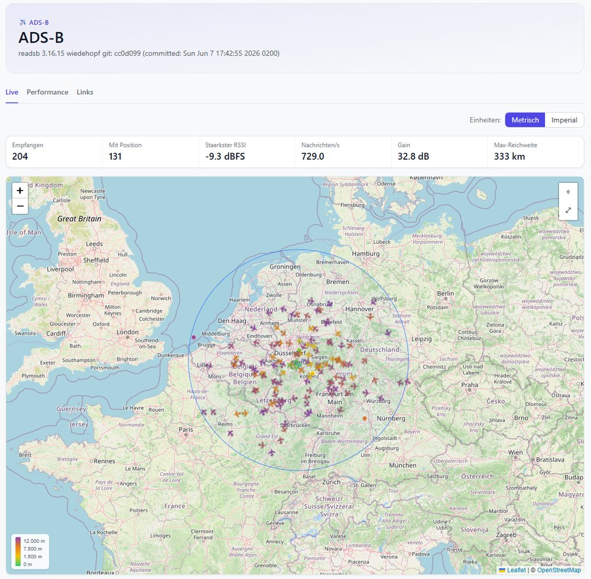

# Mein eigener Tower

Letztens waren wir mit der Familie auf dem Flugplatz Hangelar. Kleine Maschinen, die starten und landen. Und mit einem Vierjährigen zusammen staunt es sich einfach besser.

Ein eigener Flugschein ist illusorisch. Aber sehen, was da oben so los ist, das geht. Also habe ich mir eine Antenne aufs Dach gesetzt. Seitdem fühlt sich mein Arbeitszimmer ein bisschen wie ein eigener Tower an.

Flugzeuge funken ständig, wo sie sind. Position, Höhe, Kennung, Geschwindigkeit. Das läuft auf 1090 MHz und heißt ADS-B. Die Daten liegen einfach in der Luft. Wer die richtige Antenne hat, empfängt sie.

Flightradar24 kennt jeder. Schicke App, fertige Karte, alles aufbereitet. Dahinter steckt ein kommerzielles Projekt. Und auch deren Karte lebt zum großen Teil von Freiwilligen mit Antenne auf dem Dach. Mitmachen könntest du da sogar genauso. Du fütterst Flightradar mit deinen Daten. Die landen dann bei einer Firma. Mir war eine offene Community lieber. Da gehören die Daten allen.

Also geht es los mit der Recherche. Welche Antenne, welcher USB-Stick, welches Kabel. Dann rauf auf den Dachboden, Antenne montieren. Einen Raspberry Pi aufgesetzt und eingerichtet. Den RTL-SDR-Stick angeschlossen, der aus dem Funksignal Daten macht. Und dann lief es. Auf einmal sah ich, was da die ganze Zeit über mir kreist.

Klar, braucht kein Mensch. Aber es hat einfach Spaß gemacht. Genau dieses Tüfteln, bis alles läuft. Dazu der Community-Gedanke. Ich speise meine Empfangsdaten in ein Netz ein. Jeder deckt seinen Fleck ab. Zusammen wird daraus eine ziemlich große Karte.

Das Dashboard habe ich mir natürlich gleich in Todoteck gehängt. Die App, die bei mir eh für alles herhält.

Der Flugschein bleibt erstmal ein Traum. Aber meinen kleinen Tower habe ich jetzt. (Der echte in Hangelar guckt bestimmt neidisch.)
