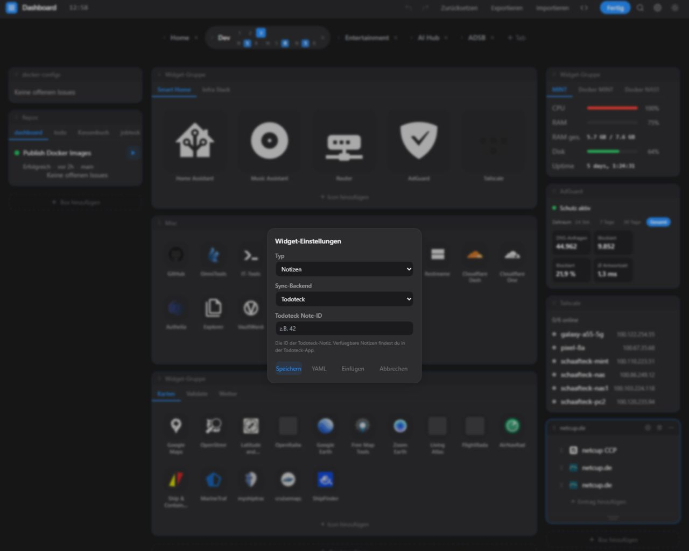
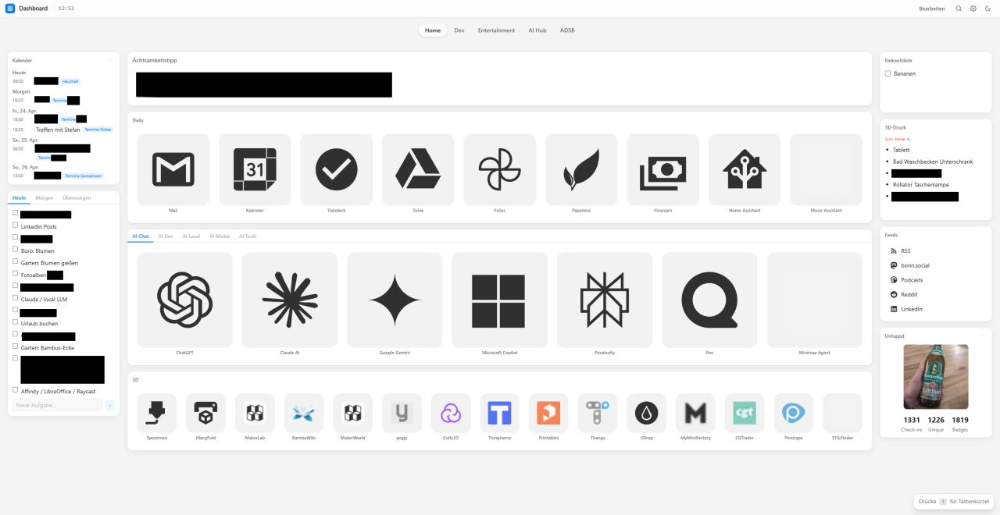
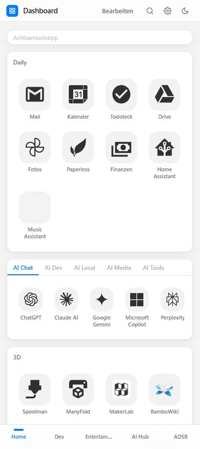

Am Ende waren es einfach zu viele Tabs.

Irgendwo der Kalender, woanders das Wetter, dann Docker, Bookmarks, Feeds, Aufgaben und noch ein paar Dinge, die ich regelmäßig im Blick haben will. Nicht dramatisch, aber jeden Tag ein bisschen unnötig.

Deshalb habe ich mir ein eigenes Dashboard gevibecodet.

Im Grunde ist es einfach eine Browser-Startseite, auf der alles zusammenkommt, was ich im Alltag brauche. Selfhosted, über eine einzige YAML-Datei konfigurierbar und so gebaut, dass nicht ich mich nach dem Tool richten muss, sondern das Tool nach mir.

Inzwischen steckt da eine ganze Menge drin: Wetter, Kalender, RSS, Docker, Server-Stats, AdGuard, GitHub, Tailscale, Aufgaben, Notizen, AutoDarts, Untappd, eigene APIs, iFrames, Widget-Gruppen und Bookmarks mit Suche.

Und wie das bei solchen Projekten eben ist, blieb es nicht bei der ursprünglichen Idee.
Aus einer simplen Startseite wurden nach und nach Drag & Drop, Spotlight-Suche, YAML-Editor im Browser, Undo/Redo, Dark Mode, Akzentfarben, mobile Ansicht, serverseitige API-Keys, Rate Limiting, SSRF-Schutz und CI/CD.

Genau solche Projekte machen mir gerade besonders Spaß, weil sie kein abstraktes Problem lösen, sondern etwas, das im Alltag sofort auffällt. Man baut etwas, nutzt es direkt selbst und merkt ziemlich schnell, ob es wirklich taugt.

Früher hätte ich bei so einer Idee wahrscheinlich gedacht: nette Vorstellung, aber dafür fehlt mir das Know-how. Heute denke ich eher: Dann baue ich mir eben die erste Version und schaue, was daraus wird. Und meistens wird es dann doch etwas größer als geplant.

Wenn es euch interessiert, zeige ich in den nächsten Tagen gerne mehr. Sinnvoll eingesetzt, kann man mit Vibecoding Ideen mindestens greifbarer machen.
