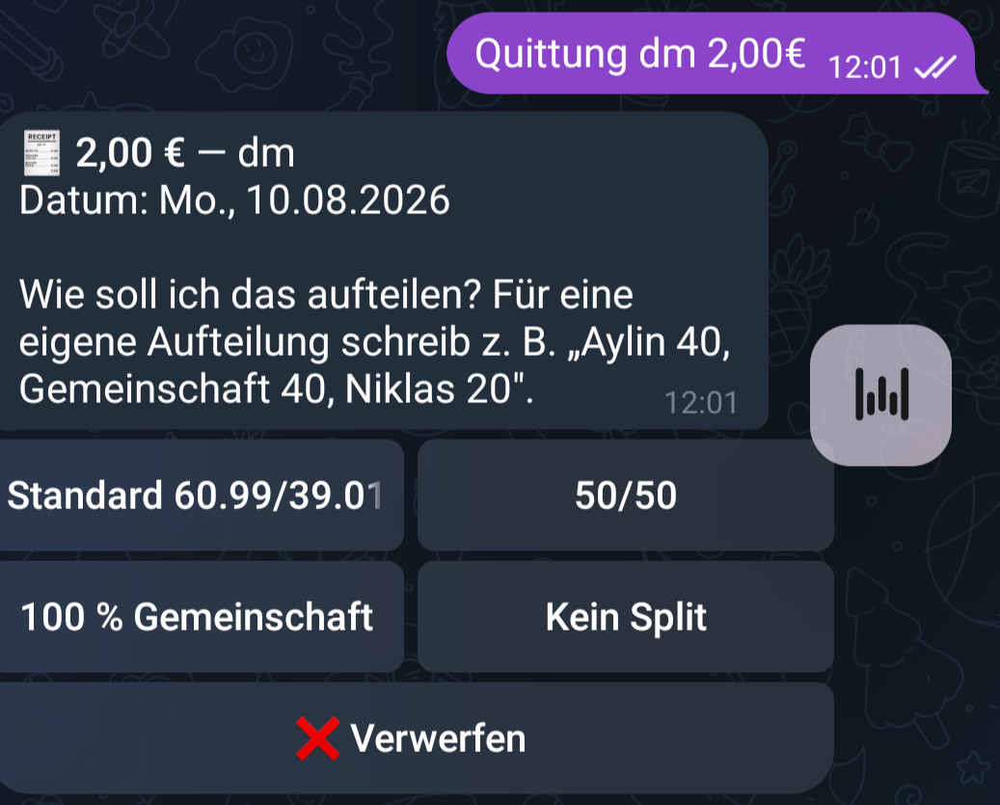
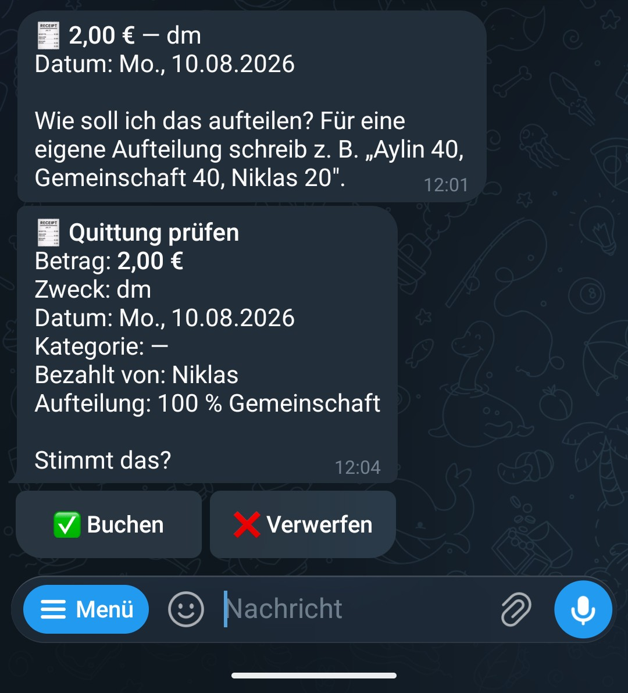
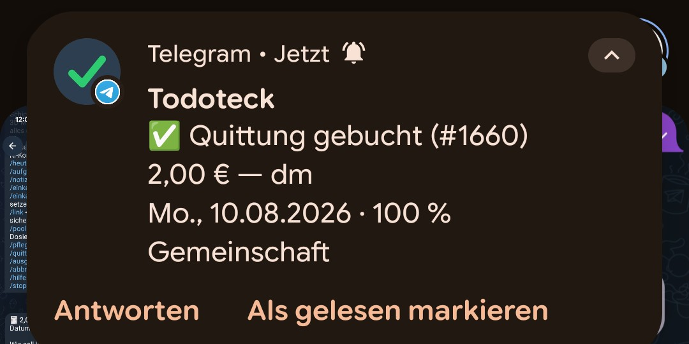
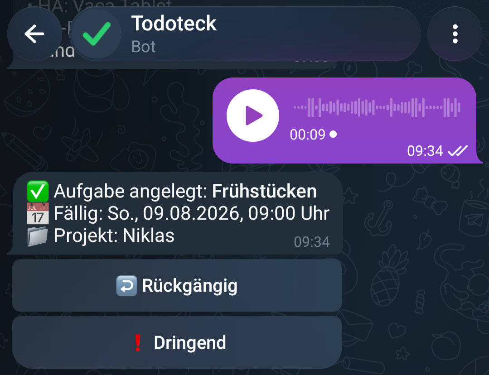

# Einfach reinquatschen

Aylin kommt vom Einkaufen, Quittung in der Hand. Und jetzt?

Wir führen unsere Ausgaben in Finanzteck, unserem selbstgebauten Kassenbuch. Splitwise-Prinzip: wer hat bezahlt, wie wird geteilt. Funktioniert super. Wenn man es einträgt.

Genau da hakte es. Wegen ihrer Teilquerschnittslähmung ist Tippen auf dem Handy für Aylin mühsam. Betrag eingeben, Kategorie suchen, Aufteilung wählen. Nichts davon schwer. Aber alles zusammen genug, dass die Quittung erstmal liegen bleibt.

Ihr Wunsch war simpel: das einfach irgendwo reinquatschen. Fertig.

Also habe ich den niedrigschwelligsten Weg gesucht, den ich finden konnte: einen Chat. Telegram kann Sprachnachrichten und einen Bot kann man da einfach reinsetzen.

Heute geht das so: Sprachnachricht an den Bot. "Rewe, dreiundvierzig achtzig." Der Bot transkribiert, versteht, dass das eine Quittung ist, und fragt nach der Aufteilung. Knöpfe drücken, bestätigen, steht im Kassenbuch.

Oder noch fauler: Foto vom Kassenbon schicken. Ein Vision-Modell liest Betrag, Händler, Datum und Kategorie raus. Der Rest ist derselbe Bestätigungs-Dialog.

Bei Geld gibt es übrigens immer eine Bestätigung. Immer. Transkription verwechselt "vierzehn neunzig" und "vierzig neunzig" zu leicht. Der Bot bucht nie, ohne dass jemand draufgetippt hat.

Und dann ist passiert, was bei solchen Projekten immer passiert. Der Kanal war da, also wanderte mehr rein.

Aufgaben in unserer Familien-App Todoteck anlegen: "Erinnere mich morgen an den Sperrmüll." Notizen diktieren. Beides legt der Bot direkt an, mit Rückgängig-Knopf, falls es Quatsch war.

Die Einkaufsliste. "Setz Milch und Butter auf die Liste." Und im Laden zeigt der Bot die offenen Einträge als Knöpfe, einer pro Artikel. Abhaken direkt im Chat, die Nachricht aktualisiert sich selbst, statt die Liste nach oben zu schieben.

Fragen geht auch. Was steht heute an? Was waren die letzten Ausgaben? Wer schuldet wem wie viel diesen Monat? Der Bot holt die Antwort aus den echten Daten.

Und in die Gegenrichtung ist der Chat ein Benachrichtigungskanal. Aufgabe fällig? Nachricht mit Erledigt-Knopf. Sync kaputt? Nachricht mit Nochmal-versuchen-Knopf.

Das Schöne daran: der Bot ist keine neue App. Er ist nur ein weiterer Eingang in das, was eh schon da ist. Darunter liegt exakt dasselbe wie unter der Web-App. Services, Rechte, Datenbank. Vorne dran ein LLM, das aus gesprochenen Sätzen strukturierte Absichten macht.

Gebaut für ein Problem: Quittung liegt rum, Eintragen nervt.

Und jetzt läuft die halbe Alltagsorganisation easy durch einen Chat.
