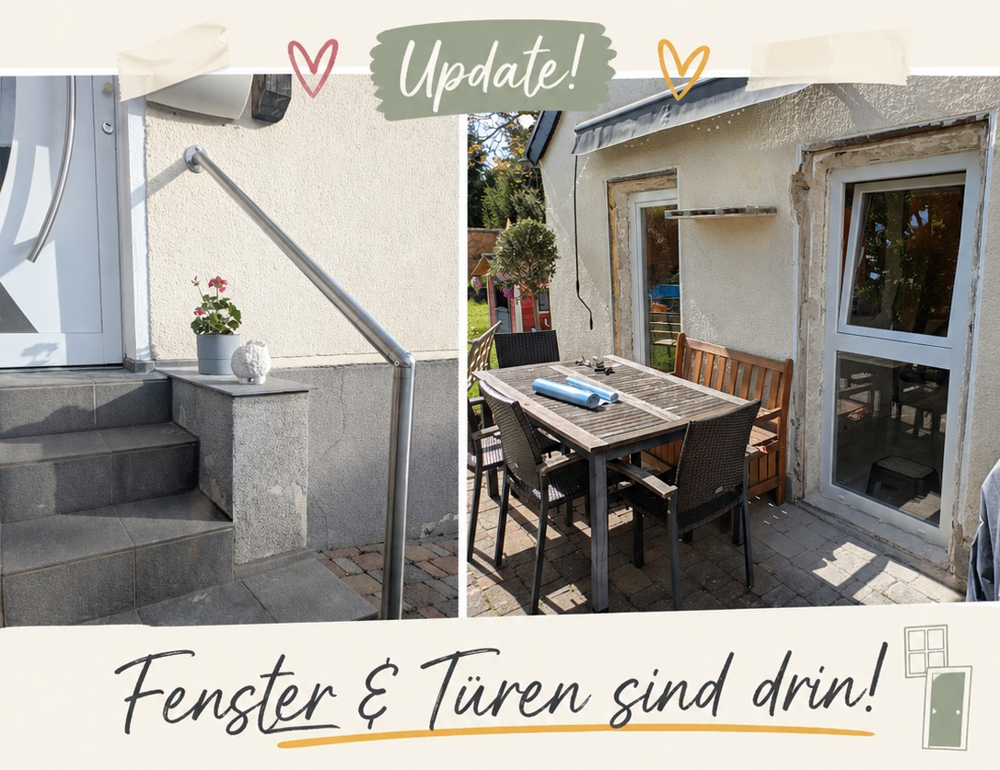

# Update: Fenster und Türen sind drin

Im Oktober haben wir unsere [GoFundMe-Kampagne](#gofundme) für den barrierefreien Umbau unseres Anbaus gestartet. Seitdem ist viel passiert – Schuppen gebaut, Anbau leergeräumt, Fliesen rausgerissen, Dachboden entrümpelt. Und gestern wieder ein großer Meilenstein.

Die Firma Kuse Metallbau aus Königswinter hat die neuen Fenster und Türen im Anbau eingesetzt. Damit weicht der Rohbau-Charakter, und man kann sich erstmals richtig vorstellen, wie Aylins barrierefreier Raum am Ende aussehen wird.

Die Zusammenarbeit mit Kuse war von Anfang bis Ende erstklassig: ehrliche, mitdenkende Beratung und eine saubere, professionelle Umsetzung. Und ein Treppengeländer für die Haustür gab es auch noch dazu. 💛

Falls jemand in eurem Umfeld einen verlässlichen Fensterbauer sucht – wir können Kuse Metallbau aus ganzem Herzen weiterempfehlen: [kuse.eufu.net](https://kuse.eufu.net/)

Voraussichtlich in zwei Wochen wird verputzt. Da hilft auch kein Vibecoding.

Dann fühlt sich auch optisch alles noch mehr nach Zuhause an.

Dankbar!
