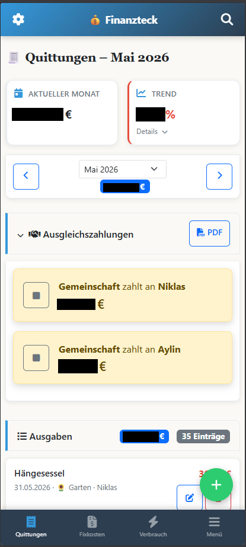
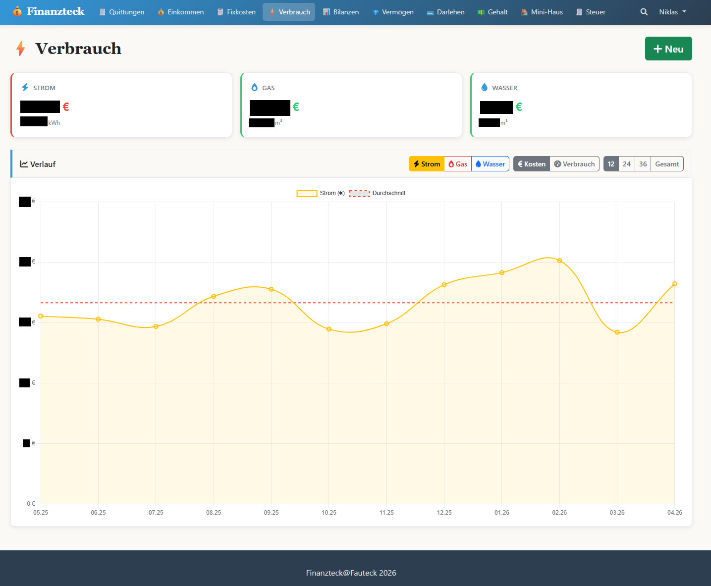

# Von Splitwise und Excel zur eigenen Finanz-App

Erst war es Splitwise.

Die geteilten Ausgaben liefen da. Wer hat die Pizza bezahlt, wer den Wocheneinkauf, wer den Tank vollgemacht. Splitwise hat das brav verbucht und am Ende ausgerechnet, wer wem was schuldet. Funktionierte.

Aber alles andere lag in Excel.

Fixkosten, Vermögen, Verbrauch, der ganze Rest. Und damit die Ausgaben auch in der Tabelle landeten, ging das jeden Monat so: CSV-Export aus Splitwise. Import in Excel. Von Hand nachbügeln. Spalten verschieben, Kategorien korrigieren, Formeln nicht kaputt machen.

Klassisches Gefrickel. Zwei Tools für eine Frage. Wie steht's denn so um die Finanzen?

Irgendwann hatte ich keinen Bock mehr. Also hab ich angefangen, mir was eigenes zu bauen. Mit Claude, Stück für Stück reingefuchst. Erst nur ein simples Kassenbuch. Eine Ausgabe rein, einer Person zuordnen, fertig.

Das Herzstück war schnell da. Jede Ausgabe bekommt einen Zahler. Niklas, Aylin oder Gemeinschaft. Jede Ausgabe lässt sich flexibel aufteilen, mit Prozent-Anteilen, die sich automatisch auf 100 balancieren. Und am Monatsende rechnet die App die Ausgleichszahlung aus. Wer wem wie viel überweisen muss. Abhaken, sobald erledigt.

Genau das, was Splitwise konnte. Nur bei mir. Mit meinen Daten. Auf unsere Bedürfnisse direkt angepasst. An einem Ort mit allem anderen.

Und weil es lief, kam Stück für Stück dazu, was vorher woanders oder gar nicht erfasst war.

Verbrauchskosten mit Zählerständen für Strom, Gas und Wasser, inklusive Tarifberechnung und Kostenverlauf.

Vermögen und Darlehen, mit Tilgungshistorie und Restschuld.

Jedes Modul, weil es einen konkreten Zweck hatte. Nicht weil ein Feature schick aussah.

Ein Detail mag ich besonders. Beim Erfassen einer Ausgabe schlägt die App die passende Kategorie vor. Das läuft komplett lokal. TF-IDF und Cosine-Similarity, kein LLM, kein API-Call, keine Daten verlassen den Server. Smart muss eben nicht Cloud heißen.

Aus dem Kassenbuch wurde Finanzteck. Im Maschinenraum drei getrennte SQLite-Datenbanken, ein Flask-Backend, Docker, selbst gehostet, die Daten bleiben bei mir.

Und „Vibecoding macht dumm"? Bei mir war es eher umgekehrt.

Ich musste ja wissen, was ich will. 2FA mit Authelia, Tailscale statt offener Portfreigaben, Session-Lifetime, Audit-Log, Secrets über Environment-Variablen, was ein sauberer Commit ist und wie GitHub eigentlich tickt.

Das hab ich beim Bauen gelernt. Denn die KI baut halt nur, was ich ihr erklären kann. Wer nicht sagen kann, was er erwartet, kann es auch nicht machen lassen.

Eigentlich wollte ich nur wissen, wer die Pizza bezahlt hat.
