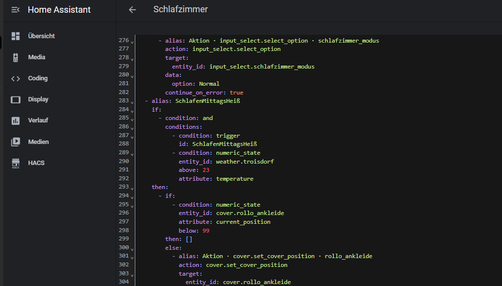

# Vom Nerd-Hobby zur Barrierefreiheit

Mein Smart-Home-System "Home Assistant" hat bei mir angefangen, wie es vermutlich bei den meisten anfängt: als Spielerei.

Ich wollte ehrlich gesagt nur einmal sehen, ob ich das hinbekomme. Eine Lampe per Sprache schalten. Dann zwei. Dann irgendwann die ganze Beleuchtung im Wohnzimmer abhängig davon, ob der Fernseher läuft und welche App gerade dort offen ist. Klassisches Nerd-Hobby. Braucht kein Mensch. Aber wenn man sich reinfuchst, ziemlich cool.

Was ich an Home Assistant gar nicht erwartet hatte: Es verändert, wie man auf Alltagsprozesse schaut.

Plötzlich ertappt man sich dabei, abends im Schlafzimmer fünf Lampen nacheinander anzuschalten und denkt: Moment, das ist doch eigentlich ein Prozess. Mit Auslöser, Bedingungen, Ergebnis. Und wenn ich diesen Prozess sauber beschreiben kann, kann ich ihn auch automatisieren. Im Job mache ich nichts anderes. Nur dass im Job am Ende selten eine Lampe angeht.

Spätestens seit der Teilquerschnittslähmung meiner Frau ist Home Assistant für uns aber keine Spielerei mehr.

Wenn sie unseren Vierjährigen abends ins Bett bringt, muss sie nicht mehr extra zurück, um Lampen oder Rollos zu bedienen. Sie sagt es einfach. Die Wege, die sie sich sparen kann, sind oft genau die Wege, die für sie am anstrengendsten wären. Was für mich früher Komfort war, ist für uns inzwischen Barrierefreiheit.

Das Schöne daran: Es ist dieselbe Technik. Dieselben Automationen. Dieselbe YAML-Datei, in der ich abends rumfrickle. Nur der Grund, warum sie da ist, hat sich verschoben.

Manchmal fängt etwas als Hobby an und wird unterwegs wichtiger, als man gedacht hätte.
