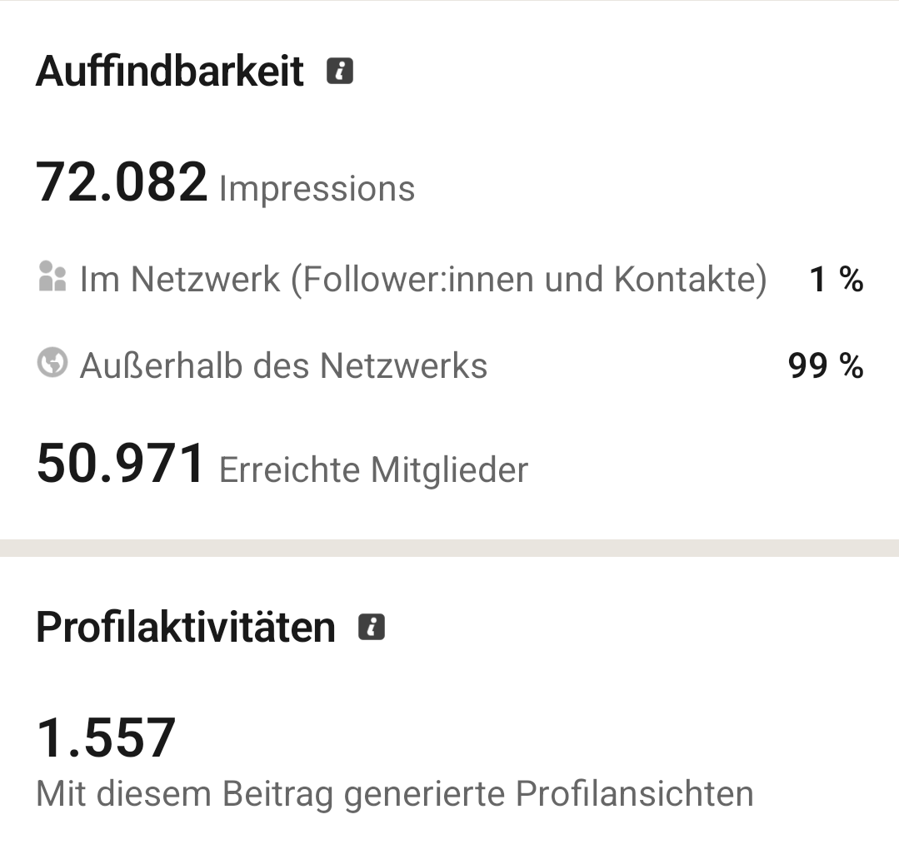

# Ich habe LinkedIn nicht verstanden

Mein letzter Post erreichte knapp 70.000 Impressionen, fast 50.000 Menschen, sorgte für 1.500 Profilaufrufe und über 50 neue Kontaktanfragen.

Mir war nicht klar, dass ein Post über meinen RTL-Abschied so viele Menschen außerhalb meines eigenen Netzwerks erreicht. Warum unglaublich viele fremde Menschen mich hinzufügen wollen, vor allem ohne zu schreiben, wieso.

Der Wert eines Netzwerks entsteht doch erst, wenn man weiß, warum man sich vernetzt oder woher man sich kennt.

Kaltakquise, bei der mir in der ersten Zeile schon was verkauft wird, brauche ich nicht. Mit den stummen Anfragen bin ich aber auch einigermaßen überfordert.

Dabei freue ich mich richtig über sinnvolle Vernetzung wie gleiche Interessen oder ähnliche Jobperspektiven.

Zwei Ausnahmen gab's: Die eine freut sich über meine Mischung aus beruflicher Erfahrung und persönlicher Note in ihrem Feed. Die andere machte mich auf eine Stellenausschreibung aufmerksam.

Der Rest bleibt für mich ein Rätsel.
