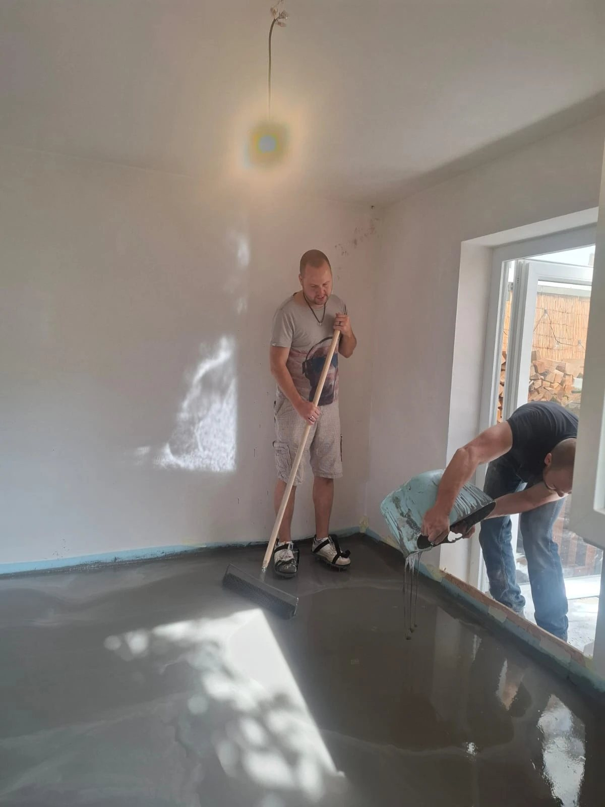
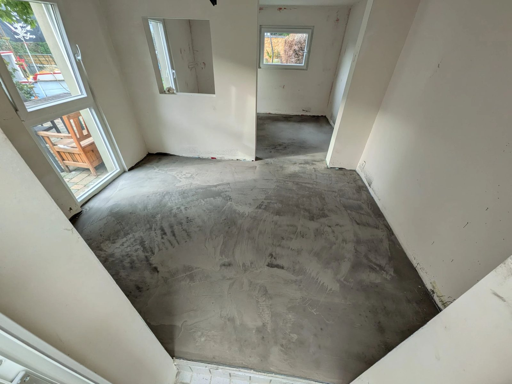
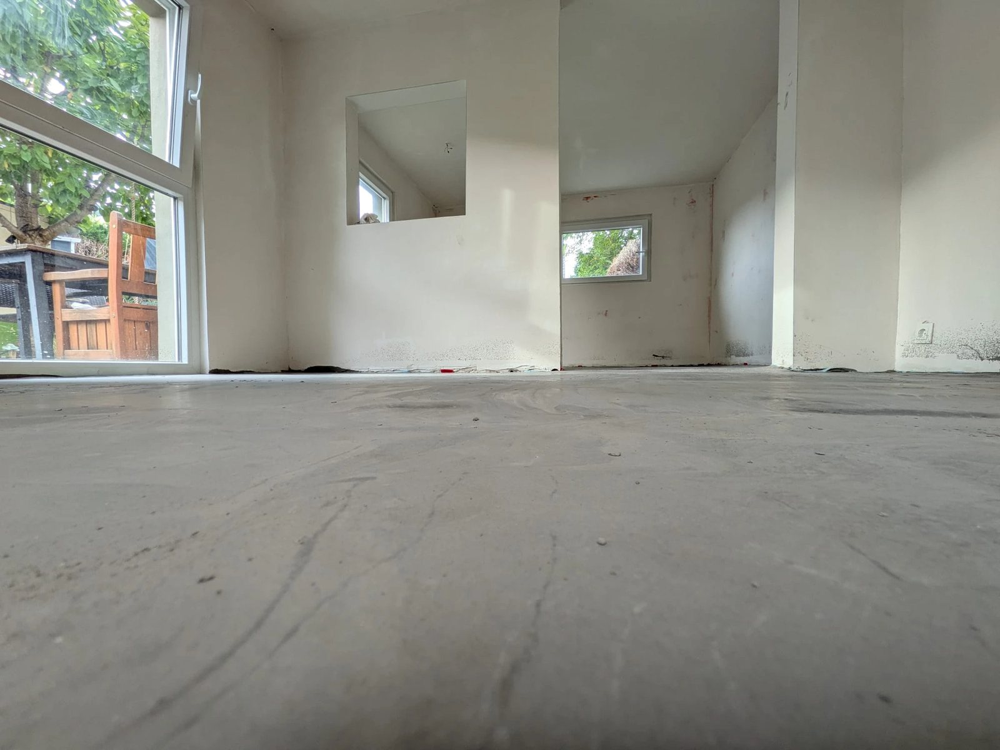

# Alles im Lot

Alles im Lot im Häuschen. Wir haben plötzlich einen ebenen Boden.

Ein neues Update zu unserem barrierefreien Umbau, für den wir vor ziemlich genau einem Jahr die GoFundMe-Kampagne gestartet haben. Beim letzten Mal waren die Wände verputzt und ich hatte geschrieben, dass als Nächstes die Ausgleichsmasse kommt. Jetzt ist sie drin.

Am Tag der Deutschen Einheit haben Basti, ich und eine halbe Tonne Ausgleichsmasse den Untergrund einheitlich gemacht. Anrühren, reinkippen, mit Nagelschuhen und Rakel hinterher, bevor alles anzieht. Eimer für Eimer, bis der Boden glatt war.

Die letzten Wochen haben wir außerdem mit Thomas die Elektrik fertig gemacht. Die Schlitze, die ich vor dem Verputzen in die Wände gestemmt habe, haben jetzt ihren Zweck: Steckdosen, und Lichtschalter direkt an der Tür, wo Aylin sie gut erreicht.

Dass das alles so vorangeht, liegt an euch. Danke für jede Spende, jedes Teilen und jedes Nachfragen, wie es läuft.

Morgen wird gestrichen. Danach kommt der Bodenbelag rein. Und dann steht da kein Rohbau mehr, sondern ein Zimmer.

Es wird.

## Bisherige Updates

- [GoFundMe: Barrierefreier Umbau für unsere Familie](#gofundme)
- [Der Umbau startet](#umbau-startet)
- [Danke, euer Support bewegt etwas](#danke-2025)
- [Update: Fenster und Türen sind drin](#fenster-tueren)
- [Alles verputzt](#verputzt)
