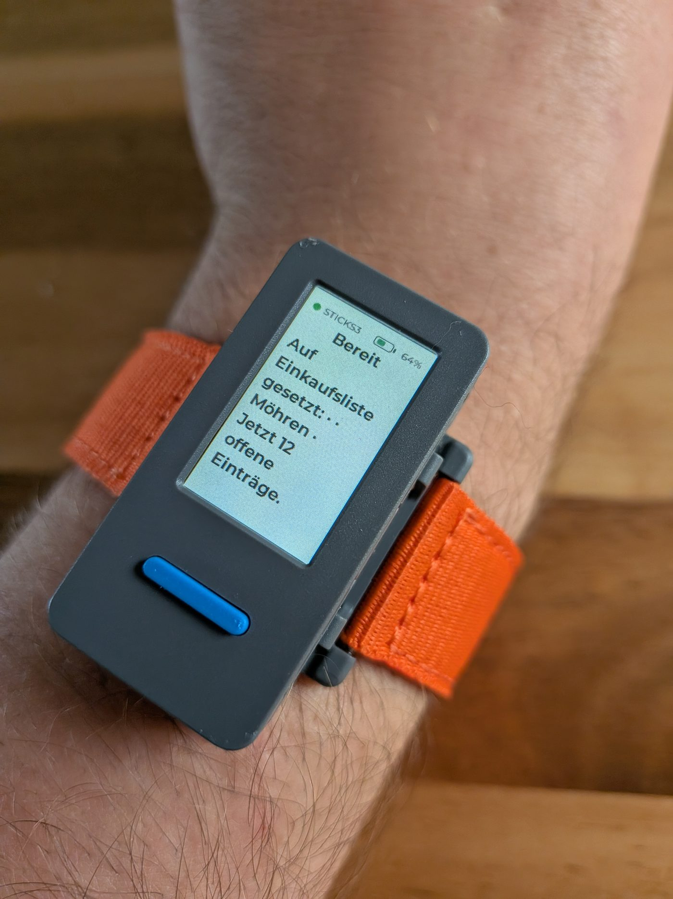

# Ein Knopf am Handgelenk

Hände im Teig. Und mir fällt ein, dass die Möhren fehlen.

Seit ein paar Monaten läuft unsere halbe Alltagsorganisation über einen Telegram-Bot. Sprachnachricht rein, Aufgabe raus. Quittung, Notiz, Einkaufsliste. Funktioniert.

Nur führt der Weg dahin jedes Mal über dasselbe: Handy rausholen, entsperren, Telegram öffnen, den richtigen Chat finden, das Mikrofonsymbol treffen und halten. Sechs Schritte, fünf davon auf Glas.

Mit Teig an den Fingern sind das sechs Schritte zu viel.

Also ein Knopf. Ein M5StickS3, 135 mal 240 Pixel Display, ein Armband dran. Drücken, sprechen, loslassen.

## Das Teure war schon gebaut

Ich hatte mit Wochen gerechnet. Es wurden vier Bausteine.

Weil das Gerät kein neues System ist. Es ist ein weiterer Eingang in das, was seit dem Bot eh schon steht: Audio kommt rein, wird transkribiert, ein Modell macht daraus eine Absicht, ein Service führt sie aus. Genau diese Kette. Ohne eine geänderte Zeile.

Neu waren: ein eigener Eingang für das Gerät, ein Token, das nicht nach fünfzehn Minuten abläuft, ein Intent für allgemeine Wissensfragen, und ein Baustein für Sprachausgabe.

Der Rest war Wiederverwendung. Das ist die unspektakulärste und beste Erkenntnis aus dem Ding.

## Bluetooth statt WLAN

Im Konzept stand ursprünglich WLAN. Gedreht hat es die Einsicht, dass das Handy sowieso in der Hosentasche liegt.

Über Bluetooth kostet die Firmware fast nichts. Der Stick meldet nur rohe Tastenereignisse, die Logik liegt beim Handy. Der Verbindungsaufbau fällt nebenbei von rund einer Sekunde auf zwei Zehntel.

Der Preis dafür ist die Stimme. Eine fertige WAV-Antwort ist über Bluetooth zu langsam, 320 KB wollen erst mal rüber. Die Sprachausgabe läuft serverseitig, am Gerät hängt sie nicht dran.

Für einen Kanal, der mit "ohne hinsehen" wirbt, ist das die größte offene Lücke. Steht so auch im Konzept.

## Was es kann und was nicht

Wissensfrage: 2,2 Sekunden. "Wie hoch ist der Mount Everest." Die schnellste Funktion ist ausgerechnet die alltäglichste.

Aufgabe anlegen oder was auf die Einkaufsliste setzen: knapp acht Sekunden. Warum das fünf Sekunden länger dauert, obwohl beide Wege durch dieselbe Transkription und dieselbe Absichtserkennung laufen, weiß ich nicht. Erst messen, dann optimieren.

Kein Wake-Word. Kein Dauerlauschen. Kein Dialog über mehrere Sätze.

Und keine Quittungen. Die brauchen eine Bestätigung mit Bezahler und Aufteilung, und das ist ein Gespräch. Ein Knopfdruck ist keins.

30 Sekunden am Stück, dann ist die Aufnahme zu Ende. Der Bot am Handy darf 300.

## Tecki

Die Werksfirmware zeigte Katzen. Süß, aber über Todoteck sagen sie nichts.

Also unser Maskottchen drauf. Tecki ist keine zweite Zeichnung. Er ist unser Logo mit Augen, und die Augen werden aus der Geometrie des Hakens berechnet. Ändere ich die Strichstärke, wandern sie mit.

Damit das überhaupt ging, musste der Haken selbst ran. Er war als Zeichen tadellos und als Körper unbrauchbar. Zu spitz, zu steil, zu dünn. Ein Augenpaar nach der üblichen Regel stand über den Strich hinaus.

Heute ist der Knick stumpfer, der Anstieg flacher, der Strich dicker. Das Maskottchen hat das Logo verändert. Nicht umgekehrt.

Sechs Zustände. Alle aus derselben Linie mit zwei Knicken. Es ändern sich nur die Farbe, ein Drehwinkel und das Gesicht.

Auf 135 mal 240 Pixeln kriegt man "verbunden, wach, hört zu, denkt nach, Fehler" nicht als Satz unter. Als Figur schon.

In der Firmware ist er außerdem billiger als ein Bild. Er ersetzt sechs eingebettete Grafiken und spart 294 KB Flash, weil er aus Grundformen gezeichnet wird statt aus Pixeln zu bestehen.

Drei Dinge fehlen mit Absicht. Einen Mund hat er nur beim Antworten, damit Logo und Maskottchen nicht auseinanderlaufen. Blinzeln kann er nicht, das Ding hängt an 440 mAh. Und im Fehlerfall gibt es kein Warndreieck, der Körper wird rot und die Statuszeile sagt es sowieso.

Wenn eine Antwort lang wird, tritt er zur Seite und überlässt dem Text den ganzen Bildschirm. Das ist die zweite Aufnahme oben. Zwölf offene Einträge, und Tecki ist weg.

## Der zweite Nutzen ist der größere

Gebaut habe ich das für nasse Hände am Pool und Teig an den Fingern.

Was dabei rausgekommen ist, ist ein Kanal ohne Touchscreen. Ein Druckpunkt, den man ertasten kann, statt einer Fläche, die man treffen muss. Kein Entsperren. Kein Zielen.

Und Töne. Einer beim Start der Aufnahme, zwei aufsteigende für eine Antwort, zwei absteigende für einen Fehler. Im Fork-README steht der Grund in einem Satz: am Handgelenk siehst du das Display nicht, während du sprichst.

Für Aylin ist das ein anderer Gewinn als für mich. Tippen auf dem Handy ist wegen ihrer Teilquerschnittslähmung mühsam, das war schon der Grund für den Bot. Ein Knopf, den man nicht treffen muss, nimmt davon nochmal einen Schritt weg.

Ehrlich bleiben muss ich trotzdem an zwei Stellen.

Halten heißt halten. Der Standardmodus ist gedrückt halten, solange man spricht. Genau das kann die falsche Anforderung sein. Die Firmware kennt einen zweiten Modus, antippen zum Starten, antippen zum Beenden. Er steht im Protokoll, er steht im Code, und keine der beiden Brücken wählt ihn bisher aus. Ein Wort in einer Zeile, zweimal. Das ist die nächste Aufgabe.

Und die Antwort wird gelesen, nicht gehört. Siehe oben.

Das Gerät liegt seit gestern auf dem Tisch und läuft. Ihres läuft noch auf der Werksfirmware.

Das ist die eigentliche Arbeit für diese Woche.
