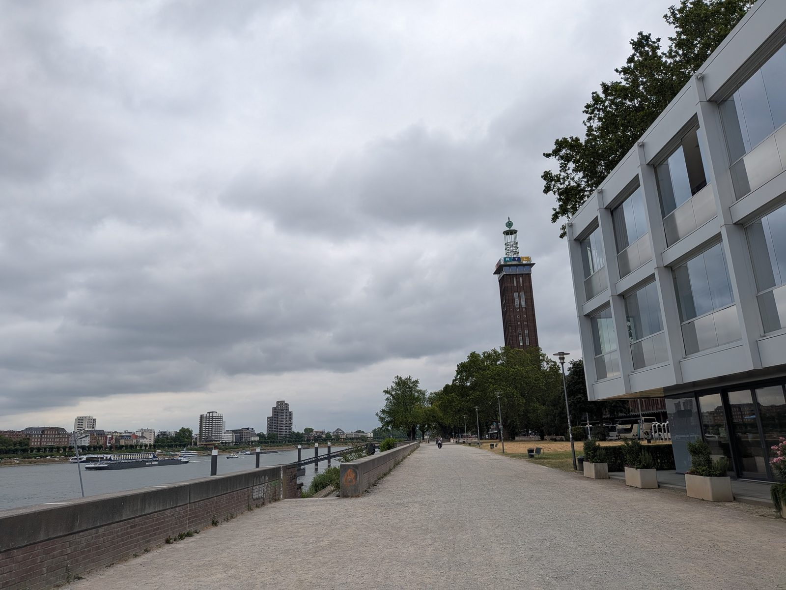

# Leichter Rucksack

Mein Rucksack ist heute auffällig leicht.

Notebook weg. Handy weg. Zutrittskarte weg.

Nach 16 Jahren bei RTL heute der letzte offizielle Akt: alles zurückgegeben, was mir das Unternehmen mal in die Hand gedrückt hat.

Dieses Jahr gehört erstmal meiner Familie. Beruflich lasse ich mir Zeit. Kein Sofort-Neustart, kein Lebenslauf-Panik-Modus. Ich warte auf den richtigen nächsten Schritt. Oder auf eine Gelegenheit, auf die ich wirklich Bock habe.

Jemand hat mir neulich auf LinkedIn geschrieben, dass ich zwischen dem ganzen Business-Gerede dort eine persönliche Note reinbringe. Das hat mich sehr gefreut.

Und deshalb gibt es dort in der Zwischenzeit auch weiterhin Vibecoding, Maker-Kram oder den ein oder anderen Gedanken zwischendurch.

Mal mit mehr, mal mit weniger Mambo und Jambo.
