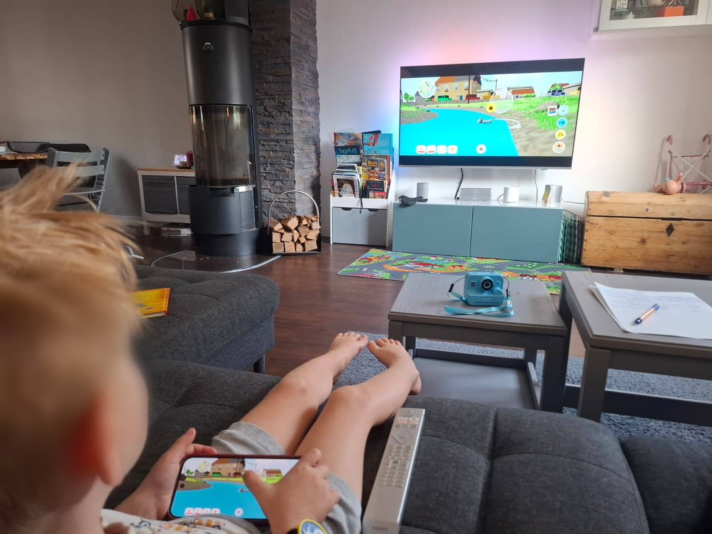
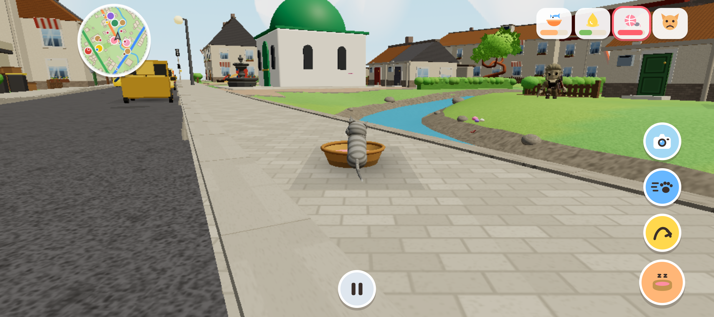

# Miez: Das Katzenspiel, das mein Sohn und ich selbst gebaut haben

Mein Sohn ist fast fünf, und Medienzeit ist bei uns begrenzt. Umso mehr soll das, was er in der Zeit guckt oder mal spielt, auch zu ihm passen.

Vor ein paar Wochen hab ich auf die Schnelle ein Katzenspiel für die Switch gesucht. Beim Ausprobieren hab ich dann gemerkt, dass es für sein Alter einfach nicht gemacht war. Man musste Missionen erfüllen, und das auch noch mit Zeitlimit.

Er wollte aber gar keine Missionen. Er wollte einfach mit der Katze die Gegend erkunden.

Nur war die Gegend auch nicht gerade kindgerecht. Die Katze lief durch ein Industriegebiet. Und dann war da noch die Steuerung, die für ihn schlicht zu komplex war.

Irgendwann hab ich gesagt: Dann bauen wir uns halt unser eigenes Spiel.

(Ich hatte natürlich keine Ahnung, worauf ich mich da einlasse. Wie immer.)

## Ein Zettel als Startpunkt

Anfang September haben wir uns zusammengesetzt und überlegt, was die Katze können soll, wo sie rumlaufen darf und was davon wirklich wichtig ist. Er hat erzählt, ich hab auf einem Zettel mitgeschrieben. Anforderungsaufnahme, nur mit mehr Miau.

Ein paar Tage später lief die erste Version. Gevibecodet mit Claude, wie die meisten meiner Projekte. Herausgekommen ist ein Browserspiel, das bei uns auf dem Fernseher läuft, und das Handy dient als Controller.

## Eine Gegend, in der man gern rumstreunt

Am wichtigsten war mir die Welt, durch die die Katze streunt. Sie sollte bunt sein, mit lustigen Figuren, die man anmiauen kann. Und die einem dann zum Beispiel eine Quizfrage stellen, zu ganz unterschiedlichen Themen.

Die Landschaft basiert auf echten Kartendaten unserer eigenen Nachbarschaft. Deshalb kommt ihm hier und da etwas bekannt vor. Nur gibt es im Spiel weniger Häuser, dafür mehr Blumen und Wiesen. Und einen Bach, den es in echt gar nicht gibt.

Lesen muss er dafür übrigens nicht. Alle Figuren können sprechen, die Stimmen kommen von ElevenLabs. Dazu gibt es einen Erzähler, der ihn durchs Spiel führt, ihn auf Entdeckungstour schickt und Tipps gibt, was er noch ausprobieren kann.

## Zugucken war das Wichtigste

Spannend wurde es, als ich ihm beim Spielen zugeschaut habe. Ich hatte mir einige Dinge ausgedacht, die auf dem Papier richtig gut funktionieren sollten. Dann lag er auf dem Sofa und hat einfach ganz anders gespielt, als ich es erwartet hatte.

Rennen zum Beispiel. Das lag auf dem Rand des Sticks, und weil ein Kind den Stick sowieso immer bis zum Anschlag drückt, ist die Katze ständig gerannt, ohne dass er das wollte.

Und dann kamen Wünsche, auf die ich selbst nie gekommen wäre. Er wollte auf ein Auto klettern können. Und irgendwann kam die Frage: „Warum bellt der Hund nicht, wenn ich vor ihm stehe?" Berechtigte Frage, eigentlich.

Manches ist auch einfach passiert. Wenn man immer weiter auf Hüpfen gedrückt hat, ist die Katze irgendwann in die Luft gestiegen. Eigentlich ein Bug. Ich hab dann einfach eine Superkraft daraus gemacht. Und damit die Katze auch wieder sicher runterkommt, kann sie mit einer Pusteblume landen.

## Kenne ich irgendwoher

Am Ende hab ich das Spiel an ihn angepasst und nicht ihn an das Spiel. Mit fast Fünfjährigen klappt das andersrum ohnehin nicht. Mit Erwachsenen übrigens auch nur so mittel.

Im Job hab ich viel mit Anforderungen zu tun, und mit Menschen, die ihre Anforderungen nicht fertig formuliert mitbringen. Das ist kein Vorwurf, das ist ganz normal. Man muss zugucken, nachfragen und auch mal Abläufe hinterfragen, die schon immer so waren. Erst dann merkt man, was wirklich gebraucht wird.

Bei meinem Sohn ist das ganz genauso, er ist nur ehrlicher. Er braucht keinen Workshop, um mir zu zeigen, was nicht passt. Er spielt einfach anders.

## Feierabend

Und weil Medienzeit bei uns begrenzt ist, hört Miez auch von selbst auf.

Im Elternbereich kann ich eine Spielzeit einstellen. Wenn die um ist, geht die Katze in ihren Korb und im Spiel wird es Abend. Kein Game Over, kein hartes Ende, einfach Feierabend. Für die Katze und für ihn.

Mein anspruchsvollster Stakeholder ist zufrieden. Meistens.
