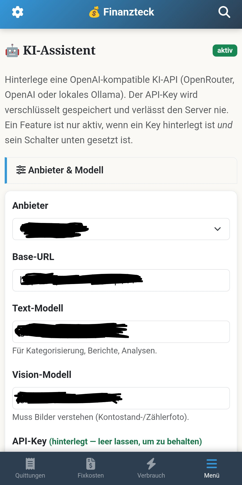
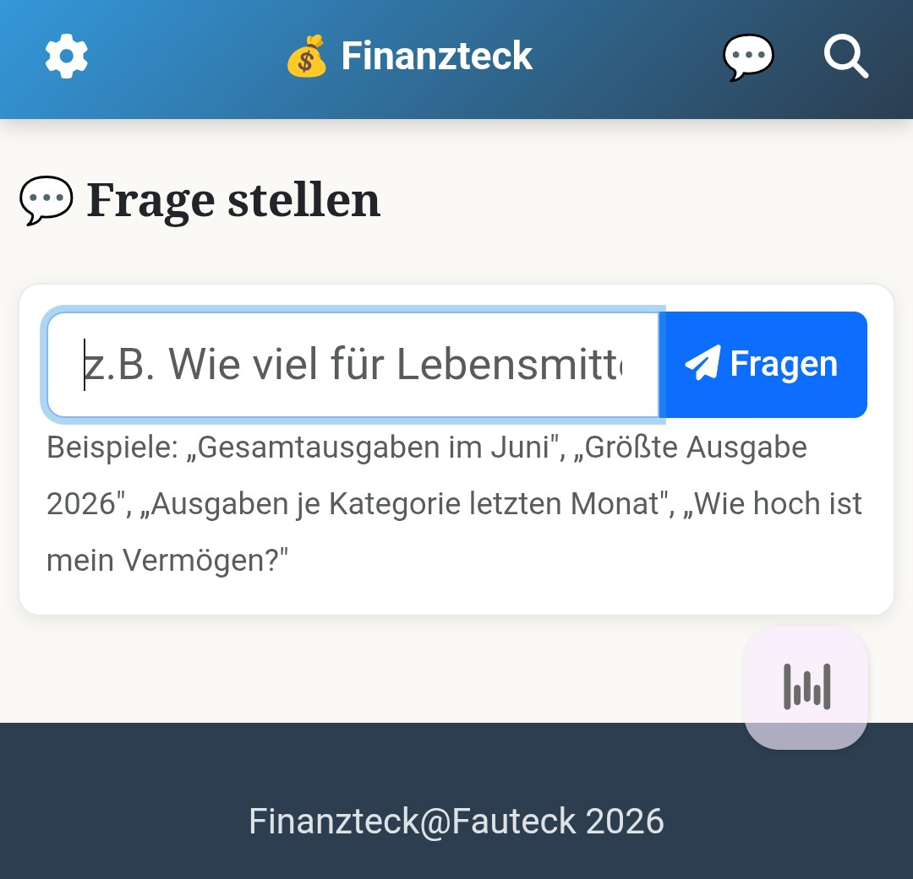

# Ein Nachmittag statt drei Konzeptionsrunden

Vor zwei Jahren, noch im alten Job. Wir wollten eine KI-Textkürzung in ein Bestandstool integrieren. API anbinden, Rechte klären, Konzeptionsrunden. Mehrere Meetings, bis überhaupt jemand einen Prototyp gebaut hat.

Heute liegen die Möglichkeiten auf der Straße. Und ich brauche für die Integration in meine eigene, perfekt auf mich zugeschnittene App keinen Nachmittag.

Die App ist [Finanzteck](https://niklasfauteck.de/blog/#finanzteck). Aus Splitwise und Excel geworden, selbst gehostet, meine Daten. Aber einmal im Monat saß ich trotzdem noch da und hab getippt.

Also kam KI dazu. Über eine API, egal ob lokal oder extern, je nachdem was gerade passt.

Jetzt reicht ein Foto vom Zähler. Ein Screenshot der Kontoübersicht. Die KI liest die Werte raus, trägt sie ein, fragt nach, wenn was fehlt oder unklar ist. Ich bestätige, fertig.

Kein Abtippen von Kontoständen mehr. Kein Ablesen und Eintippen der Zählerstände mehr. Nur noch prüfen und bestätigen.

Und weil das Modell sowieso lief, hab ich gleich noch mehr eingebaut. Kategorie-Vorschläge bei neuen Ausgabe-Einträgen. Beschreibungen normalisieren. Eine Verbrauchsanalyse für Strom, Gas, Wasser. Ein Budget-Coach mit Sparhinweisen. Eine Frage-Box, in die ich einfach reinschreiben kann, was ich wissen will.

"Wie hoch ist mein Vermögen?" Antwort kommt direkt aus den eigenen Daten.

Wer statt lokal lieber extern rechnen lässt, über OpenRouter oder OpenAI zum Beispiel, kriegt die Kosten trotzdem im Blick. Läufe, Tokens, Kosten, aufgeschlüsselt nach Woche, Monat, Jahr, gesamt. Bei mir zum Test: zehn Läufe, gut fünftausend Tokens, 0,0042 US-Dollar.

Und zum Monatsersten muss ich nicht mal mehr selbst dran denken. Finanzteck legt mir dann automatisch eine Aufgabe in [Todoteck](https://niklasfauteck.de/blog/#todoteck) an, mit einem KI-Monatsbericht als Fließtext plus Aktionsliste direkt dabei. Zeit für die Runde.

Vor zwei Jahren hätte dafür ein ganzes Team jede Menge Expertise gebraucht. Architektur, API-Anbindung, Grundlagen, die man sich erst erarbeiten musste. Heute reicht rudimentäres Verständnis und ein bisschen Motivation. In der kurzen Zeit haben sich so viele Ideen und Muster etabliert, dass ich sie einfach übernehmen kann statt sie selbst erfinden zu müssen.

Für ein Homelab-Projekt wie meins reicht das. Für einen echten Business Case natürlich nicht. Da kommen Skalierung, Verfügbarkeit, Compliance, mehrere Nutzer dazu, ein ganzer Rattenschwanz. Vibecoding allein trägt das nicht.

Aber genau die Absicherung lässt sich mit KI auch prüfen. Sicherheitshärtung, Performance, Datensicherheit, Code-Effizienz. Beim nächsten Mal zeige ich, mit welchen Skills ich versuche, das zumindest in privaten Projekten so gut es geht zu kompensieren.
