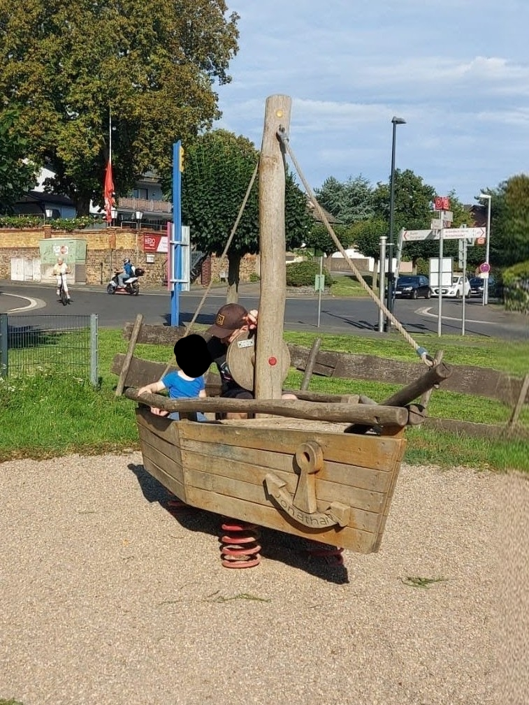
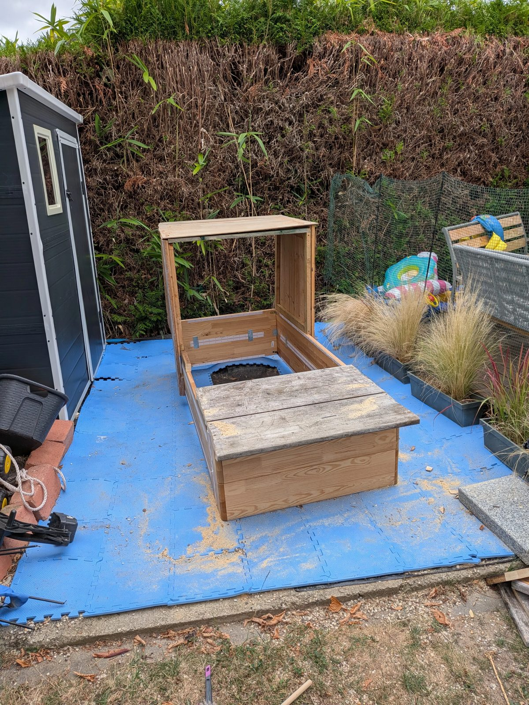
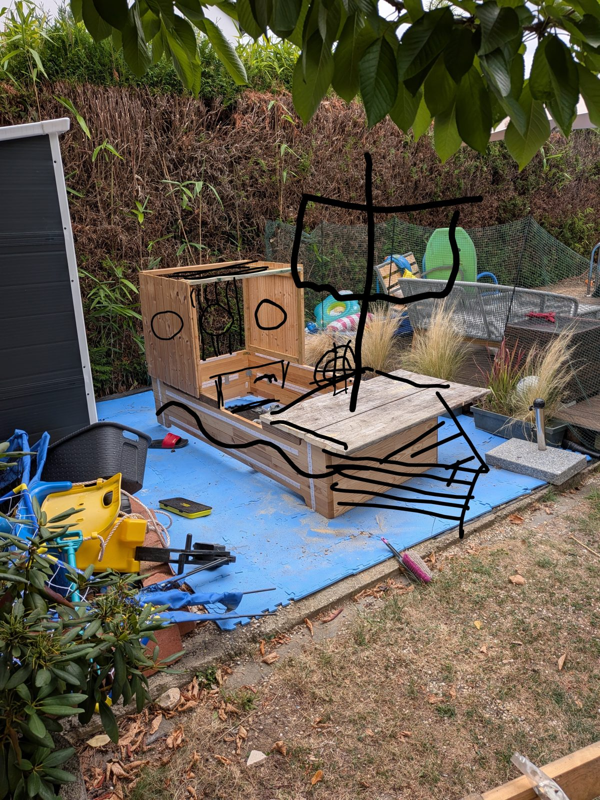
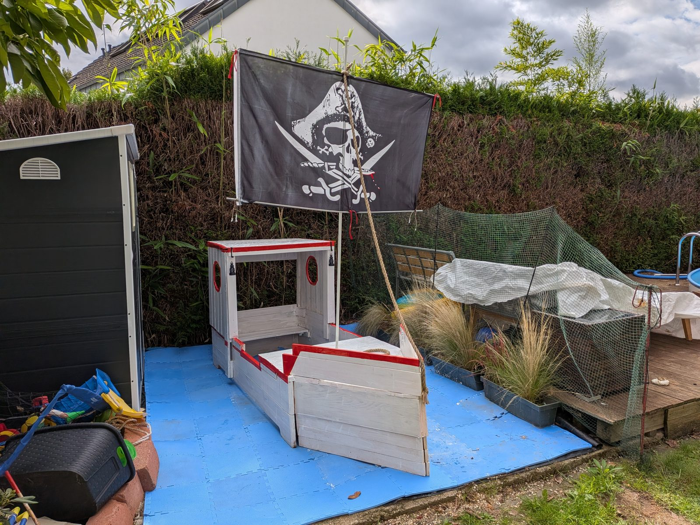

# Aus einem Bett wird ein Piratenschiff

Unser altes Bett hat eine zweite Karriere als Piratenschiff gestartet.

## Die Anforderung

Angefangen hat es auf einem Spielplatz. Mit einem Holzschiff mit Mast und Anker. Unser Sohn, großer Käpt'n-Sharky-Fan, und wir hatten richtig viel Spaß darin.

Und da kam zum ersten Mal der Gedanke: Boah, ein eigenes Schiff bauen. Das wäre doch lustig.

Dann passierte erstmal nichts. Klassische Idee für irgendwann.

## Das Material

Bis wir ein neues Bett bekommen haben. Beim Abbau lagen plötzlich zwei große Holzrahmen im Garten. Also: Rumpf.

Rahmen aufgestellt. Alte Bretter als Deck drauf. Kajüte hochgezogen.

Sah noch nach Bett aus. Aber schon ein bisschen nach Schiff.

## Das Wireframe

Dann Handy raus. Foto gemacht. Mit dem Finger drübergekritzelt. Mast. Segel. Bullaugen. Bug.

Statt Wireframes für Software diesmal halt für Holz. Funktioniert erstaunlich ähnlich. Man sieht sofort, was fehlt. Und der Auftraggeber kann mit dem Finger drauf zeigen.

## Das Release

Und jetzt steht da plötzlich ein weißes Schiff mit roter Kante. Mit Bullaugen, zwei kleinen Laternen und einem Piratensegel, das man vermutlich bis zum Nachbarn sieht.

## Das Backlog

Fertig ist es natürlich nicht. Das Backlog ist noch lang:

- ein Anker
- ein Steuerrad
- Tau ringsrum
- ein sprechender Papagei im Mastkorb

Der Papagei bekommt Arcade-Buttons und einen ESP32. Knopf drücken, Papagei redet. (Ja, ich weiß. Der Papagei wird eskalieren.)

## Warum gerade jetzt

Nach meinem Abschied von RTL habe ich gerade eine berufliche Auszeit. Und damit Zeit für einen sehr anspruchsvollen Auftraggeber. Knapp fünf Jahre alt. Klare Anforderungen. Stakeholder zufrieden. MVP sticht in See.
