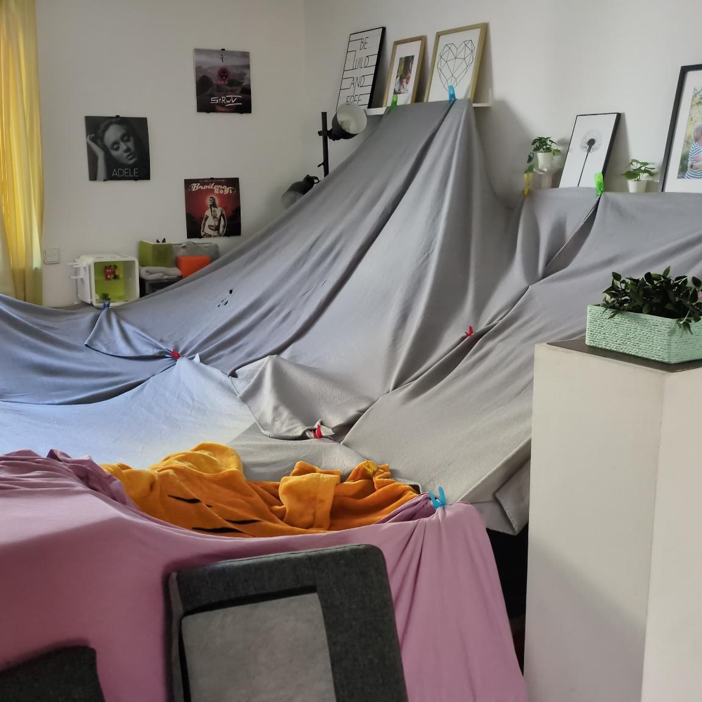
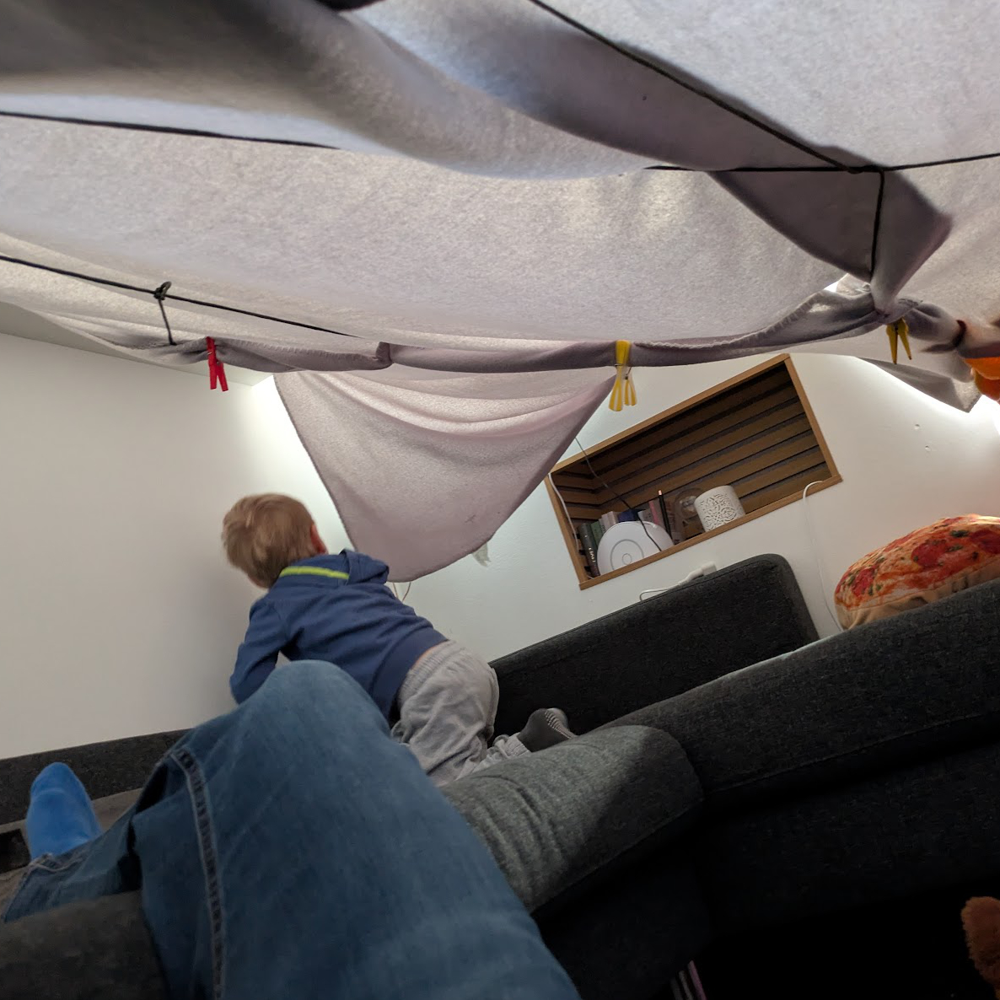

# Räuberhöhle

Bevor ich im nächsten Post wieder über Vibecoding schreibe und zeige, wie ich mein Browser-Tab-Chaos und meine Finanz-Excel-Listen in den Griff bekommen habe, heute mal ein anderes Projekt.

Kein 3D-Druck.
Kein Dashboard.
Keine Automation.

Sondern Höhlenbau mit meinem vierjährigen Sohn.

Wobei Höhle nicht ganz stimmt. Es war eher ein Zelt. Paracord gespannt, leichte Decken drüber, mit Wäscheklammern befestigt. Improvisiert, aber stabil genug für den Einsatzzweck.

Die Kita-Notbetreuung wurde also sinnvoll genutzt. In unserer Räuberhöhle gab's Snacks und wir haben zusammen Biene Maja geschaut. Und ich musste kurz daran denken, dass das gar nicht so weit weg ist von den Dingen, über die ich hier sonst schreibe.

Du nimmst, was da ist.
Du baust mit einfachen Mitteln.
Du machst es ein kleines bisschen aufwendiger als nötig.
Und am Ende ist nicht entscheidend, ob es perfekt ist. Sondern ob es funktioniert und jemand Freude daran hat.

Manchmal ist einfach mal machen eben kein Sideproject, sondern ein Paracord-Seil zwischen zwei Möbelstücken.
Maker-Mindset. Nur mit mehr Wäscheklammern und dem besseren Publikum.

Was ich aus der Räuberhöhle mitnehme:
Stakeholder zufrieden, MVP stand, Entertainment lief.
