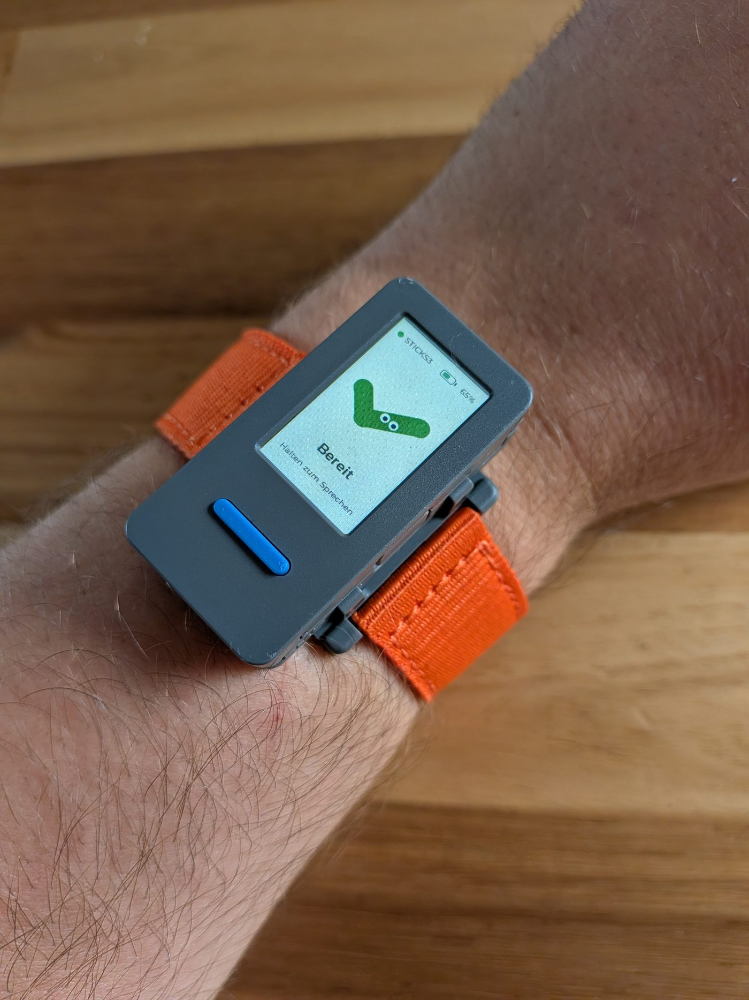
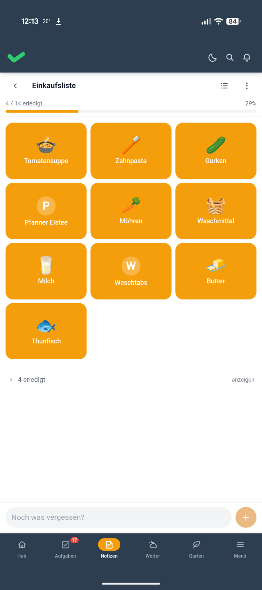

# Der Knopf am Handgelenk

Todoteck ist unsere Familien-App. Aufgaben, Notizen, Einkaufsliste, alles selbst gehostet.

Dazu gibt es seit einer Weile einen Telegram-Bot. Sprachnachricht rein, Eintrag raus. Für Aylin mit ihrer Teilquerschnittslähmung schon eine Erleichterung, nicht alles in die App tippen zu müssen, denn ihre Hände machen nicht immer das, was sie sollen.

Aber geht es nicht sogar noch leichter statt erst das Handy rauszuholen, es zu entsperren und im Telegram-Chat die Sprachnachricht zu starten? Ein echter Knopf wäre was.

## Der Anstoß kam aus der Timeline

Ich scrolle abends durch LinkedIn. Ein Beitrag von Tristan Behrens, der so einen kleinen Handheld in die Kamera hält. Sprechtaste drücken, Frage stellen, seine KI antwortet.

Mein erster Gedanke: ey, das kann ich doch auch gut an meine eigene Familien-App anbinden.

Ein paar Abende später liegt das Ding hier. Mit Armband.

## Wie sich das anfühlt

Taste drücken.

Reinsprechen.

Loslassen.

Lesen.

„Zahnpasta." Steht auf der Einkaufsliste.

„Erinner mich dran, Montag beim Kinderarzt anzurufen." Steht als Aufgabe drin.

„Wie hoch ist der Mount Everest?" Steht als Antwort auf dem Display, nach gut zwei Sekunden.

Kein Entsperren. Kein Chat suchen. Kein Zielen.

Dank grobem Verständnis, was damit ginge und was nicht, und mithilfe von Vibecoding war das Ding an einem Tag auf Todoteck und die eigenen Bedürfnisse angepasst.

Es hängt per Bluetooth am Handy, das sowieso in der Hosentasche liegt. Zuhause, im Garten, unterwegs.

## Was das für ein Ding ist

Ein M5Stick S3. Daumengroß, Display vorne, Mikrofon drin, Akku drin, eine Taste an der Seite. Armband-Kit und Revers-Clip gibt es dazu.

Das Entscheidende daran: das ist kein Produkt, das ist ein Development Kit. Es kommt mit einer Firmware ab Werk, und die darfst du wegwerfen.

USB dran, eigene Firmware drauf, fertig.

Kein Konto. Keine Cloud. Und keine App, die mir sagt, was mein Gerät darf.

Bei einem Echo Dot oder einem Google-Lautsprecher bekomme ich genau die Funktionen, die vorgesehen sind. Und die Sprache geht an einen Server, der mir nicht gehört. Hier läuft alles gegen unsere eigene Instanz.

Wenn mir etwas nicht passt, ändere ich es selbst. Und wenn ich was kaputt mache, flashe ich neu.

## Unser Maskottchen Tecki wohnt jetzt auf dem Display

Die Firmware stammt aus einem Open-Source-Projekt, das ich geforkt habe. Ab Werk führt eine Katze einen auf dem Stick durch die Zustände: schläft, bereit, hört zu, denkt nach, spricht, Fehler. Süß. Aber Todoteck hat ja nur einen Erledigt-Haken als Logo und nirgends eine Katze.

Also brauchte es noch Tecki, sozusagen Karl Klammer meiner Familien-App. Ein Häkchen mit Augen.

Nur dass er nie fragt, ob man einen Brief schreiben möchte.

## Weiterlesen

- [Einfach reinquatschen](https://niklasfauteck.de/blog/#einfach-reinquatschen) — der Telegram-Bot, aus dem der Stick hervorgegangen ist
- [Todoteck: Vibecoding für die Familie](https://niklasfauteck.de/blog/#todoteck) — wie die App überhaupt entstanden ist
- [Todoteck: API, MCP und der Alltag](https://niklasfauteck.de/blog/#todoteck-mcp) — Schnittstellen, E-Ink-Display und die anderen Wege in die App
- [Der Beitrag von Tristan Behrens auf LinkedIn](https://www.linkedin.com/posts/dr-tristan-behrens-734967a2_wer-einmal-mit-esp32-angefangen-hat-h%C3%B6rt-activity-7492655105989582848-cUk-), der den Anstoß gegeben hat
