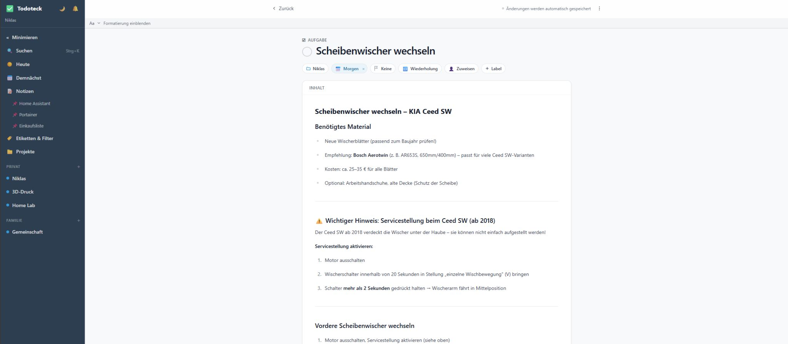
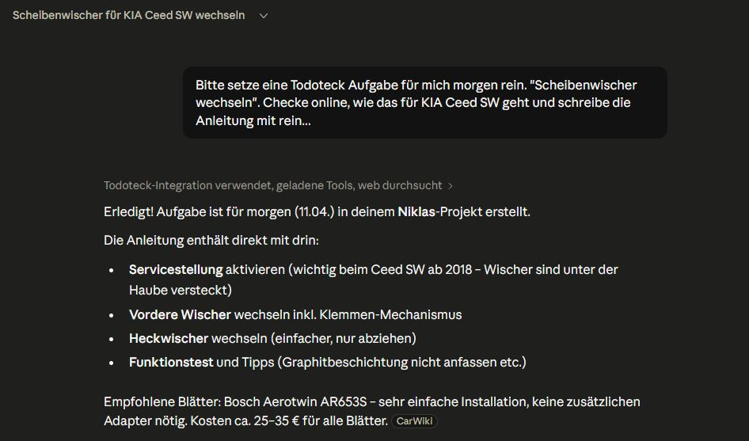

# Todoteck: API, MCP und der Alltag

Anfang der Woche habe ich geschrieben, dass ich mir eine eigene App gebaut habe. Einfach, weil ich keine gefunden habe, die Aufgaben und Notizen wirklich sinnvoll zusammenbringt.

Seitdem ist noch etwas dazugekommen. Der Gedanke dahinter war wieder derselbe: bestehende Gewohnheiten nicht aufbrechen, sondern die App an unseren Alltag anpassen.

Als Erstes habe ich der App eine eigene API gegeben.

Meine Frau sagt zu unseren smarten Lautsprechern zum Beispiel: "Hey Google, setze Milch auf meine Einkaufsliste." Bisher landet das nur in Google Keep. Todoteck holt diesen Eintrag jetzt automatisch ab und zeigt ihn direkt in der Einkaufsliste an. Auf jedem Gerät. Über eine weitere API auch auf dem E-Ink-Display im Flur. Und über eine native Android-App mit Widgets direkt auf dem Startbildschirm.

Es gibt also keine neue Gewohnheit, die man erst lernen muss. Niemandem muss man etwas erklären. Es passiert einfach im Hintergrund.

Danach bin ich noch einen Schritt weitergegangen: MCP, also Model Context Protocol. Die Idee ist eigentlich ganz einfach. Claude redet nicht mehr nur mit mir, sondern direkt mit meiner App.

Sonntag nach dem Mittagessen frage ich einfach: "Was steht nächste Woche an?" Dann kommen die Antworten direkt zurück. Mittwoch Sim Racing mit meinen Kumpels. Freitag Zahnarzt. Samstag einkaufen.

Dann sage ich: "Füg beim Einkauf noch Waschmittel hinzu." Ist drin.

Oder: "Erinner mich am Freitag daran, was ich dem Zahnarzt sagen wollte." Auch drin.

Und wenn ich dann am Freitag kurz vor dem Termin frage: "Was wollte ich da nochmal sagen?", weiß Claude es. Weil ich genau diese Notiz ein paar Tage vorher hinterlegt habe.

Kein Suchen. Kein App-Wechsel. Einfach fragen.

Das Protokoll ist offen, und der Einstieg war deutlich einfacher, als ich gedacht hätte. Wer neugierig ist, sollte einfach mal anfangen. Oder fragt mich gerne!
