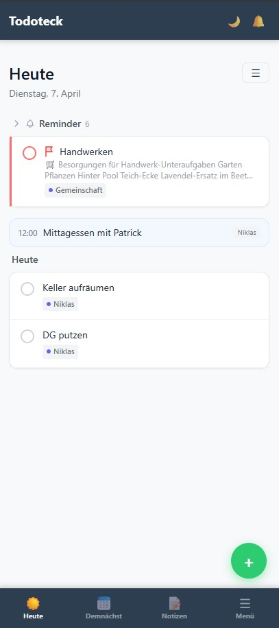
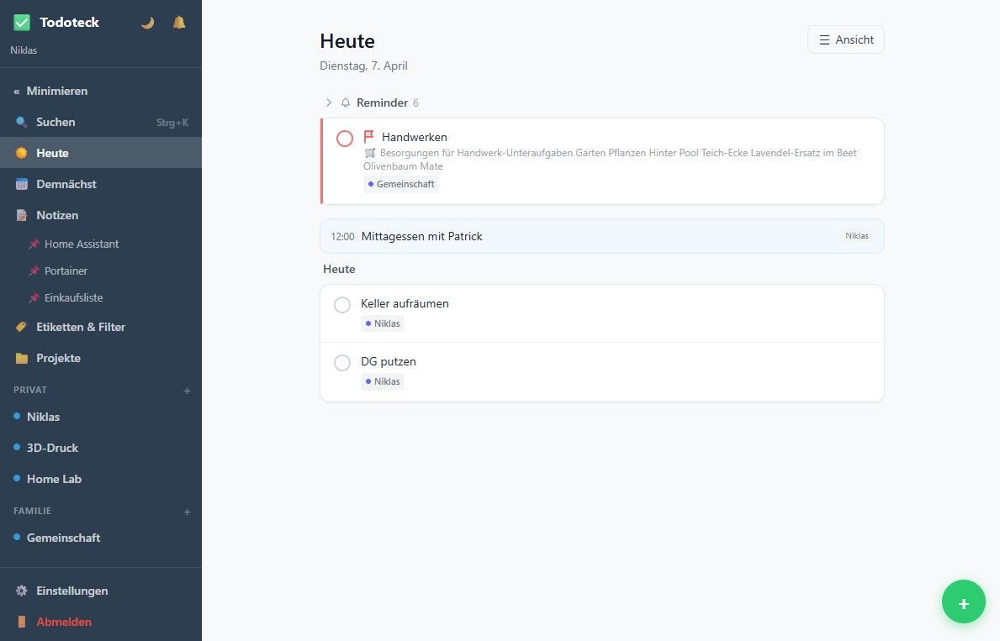

# Todoteck: Vibecoding für die Familie

Ich habe keine passende App gefunden. Also habe ich sie für uns gebaut.

Ich wollte To-dos und Notizen in einem System. Beides hängt für mich direkt zusammen. Aus einer Notiz wird oft eine Aufgabe. Und eine Aufgabe braucht meist den passenden Kontext. Die fertigen Tools, die ich ausprobiert habe, konnten immer nur das eine oder das andere wirklich gut.

Also habe ich es selbst gebaut. Mit KI-Unterstützung und ohne klassische Programmiererfahrung. Mit Integration unserer Google Kalender und zur Keep Einkaufsliste, mit eigener Programmierschnittstelle, selfhosted. Genau das macht Vibecoding heute möglich.

Am Ende ist ein schlichtes Tool entstanden, das genau so funktioniert, wie wir es als Familie brauchen. Crazy, denn vor zwei Jahren hätte ich das nicht gekonnt. Heute kann ich es.

Letzte Woche habe ich der App noch etwas hinzugefügt, das ich mir selbst vorher so nicht hätte vorstellen können. Mehr dazu in ein paar Tagen.

(Ja, ich weiß, ich muss auch noch den Keller aufräumen. Mache ich gleich nach dem LinkedIn-Post, wirklich!)
