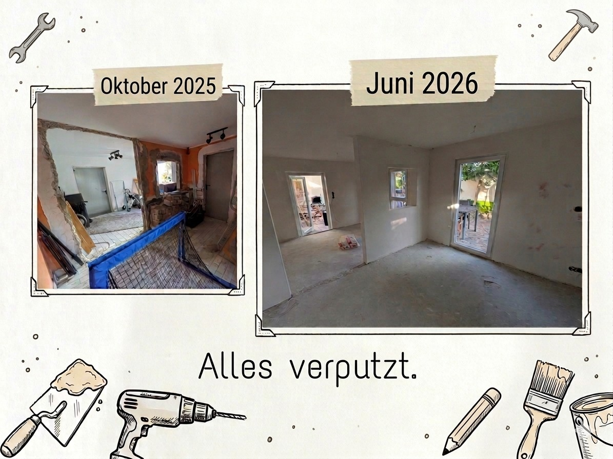

# Alles verputzt

Und wieder sind wir einen Schritt weiter beim barrierefreien Umbau, für den wir im Oktober eine GoFundMe-Kampagne gestartet hatten. Mit glatten Wänden und sauber verputzten Fenstern und Türen sieht der Anbau auf einmal zum ersten Mal echt nach einem Zimmer aus. Jetzt stehen wir drin und sehen schon Aylins Raum fertig eingerichtet vor unserem geistigen Auge.

Bevor verputzt wurde, habe ich selbst noch die Wände geschlitzt. Für ein paar zusätzliche Steckdosen, und vor allem für Lichtschalter direkt an der Eingangstür, wo sie meine Frau gut erreicht. Klingt nach Kleinigkeit, ist aber genau das, was später darüber entscheidet, ob der Raum wirklich barrierefrei ist. Und einmal verputzt ist verputzt.

Dass wir überhaupt so weit sind, liegt an euch. An jeder Spende, jedem Kontakt, jedem Teilen. Ich schreibe das in jedem Update, aber es stimmt halt jedes Mal aufs Neue: Danke.

Als Nächstes kommt die Ausgleichsmasse auf den Boden und es wird gestrichen. Weiter geht's.

## Bisherige Updates

- [GoFundMe: Barrierefreier Umbau für unsere Familie](#gofundme)
- [Der Umbau startet](#umbau-startet)
- [Danke, euer Support bewegt etwas](#danke-2025)
- [Update: Fenster und Türen sind drin](#fenster-tueren)
