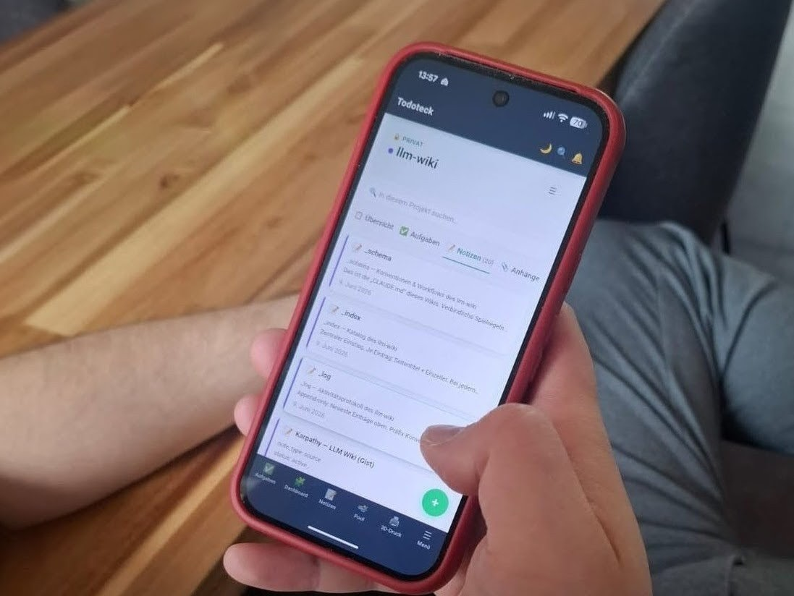

# Ein Wiki nur für die KI

Zu jedem Projekt hinterlege ich der KI eine Markdown-Datei. CLAUDE.md. Da steht das Basiswissen drin und die Regeln, an die sich Claude halten soll. Damit ich nicht in jeder Session von vorne anfange.

Das war von Anfang an klug. Einmal aufschreiben, dann liest die KI es selbst.

Nur lag das eigentliche Grundwissen verstreut. In einzelnen Dateien, in Repos, halb in meinem Kopf. Ich wollte es an einem Ort. Zentral, selbst gehostet, immer aktuell.

## Woher die Idee kommt

Die Idee ist nicht von mir. Andrej Karpathy hat sie als "LLM Wiki" beschrieben. Der Dreh dabei: Die KI pflegt das Wiki selbst, statt deine Notizen bei jeder Frage neu zu durchsuchen. Sie schreibt die Zusammenfassungen, setzt die Querverweise, hält den Index aktuell. Aufmerksam wurde ich darauf durch die [AInauten](https://ainauten.com). Karpathys Original liegt als [Gist auf GitHub](https://gist.github.com/karpathy/442a6bf555914893e9891c11519de94f).

Karpathy macht das mit Markdown-Dateien in Obsidian. Wollte ich so nicht. Ich hatte eh schon Todoteck. Meine selbstgebaute Aufgaben- und Notizen-App. Da liegt mein Kram sowieso.

Zwei Gründe sprachen dafür.

Die Daten gehören mir. Kein extra Anbieter, kein zweiter Ort, den ich nebenbei aktuell halten muss.

Und ich hatte schon einen MCP-Server am Laufen. Den musste ich nur erweitern, statt einen neuen aufzusetzen.

Also liegt das Wiki jetzt als Notizen in Todoteck.

## Nur noch ein Verweis

Die Notizen sind direkt aus Todoteck erreichbar. Über MCP. Claude liest sie, ohne dass ich was kopiere.

In meinen Projektanweisungen und CLAUDE.md-Dateien steht jetzt nur noch ein Zeiger: "Deine vollständige Anweisung lebt im Todoteck-Projekt »llm-wiki«, erreichbar über den MCP-Connector."

## Warum mir das gefällt

Jetzt liegt mein Wissen bei mir. Auf meinem Server, in meiner App.

Und ich verweise immer auf dieselbe Quelle, statt jeder neuen Session alles von vorne zu erklären. Einmal aufschreiben. Immer wieder drauf zeigen.

Der KI-Markt bleibt mega agil. Modelle und Anbieter werde ich wechseln. Das Wissen wandert einfach mit. Plug and play.
